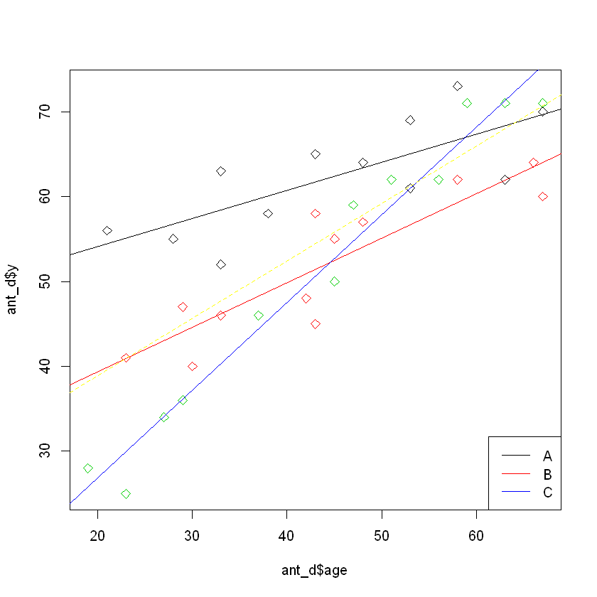
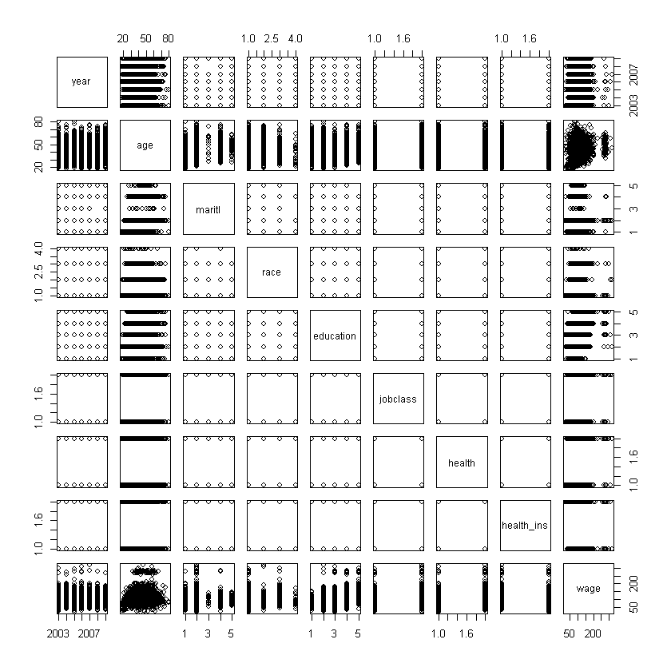
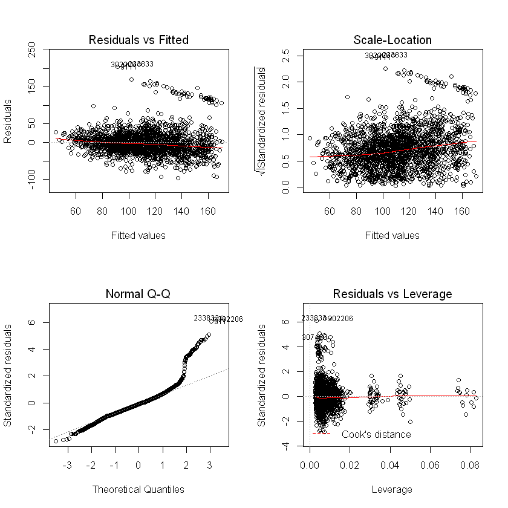
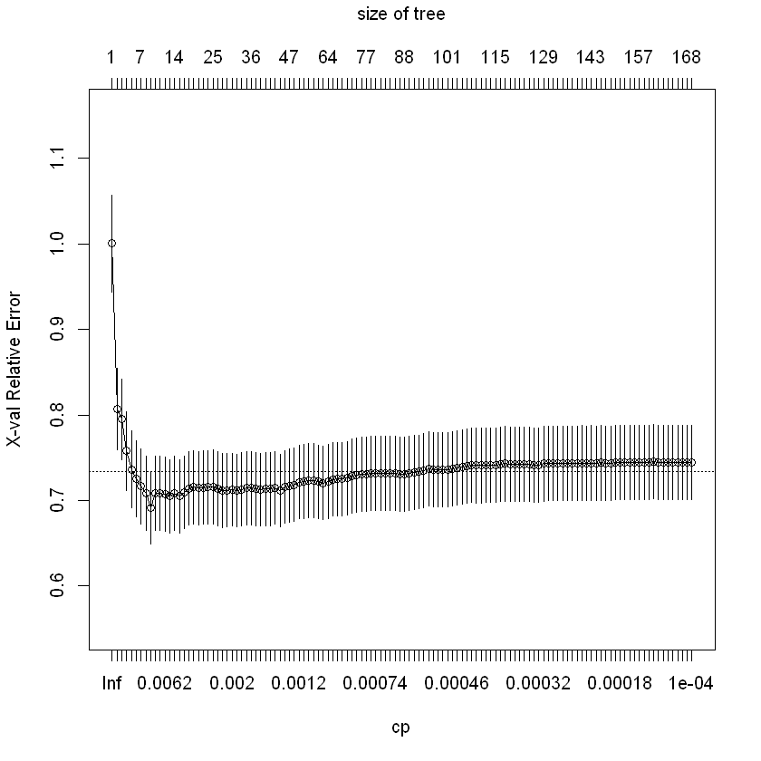
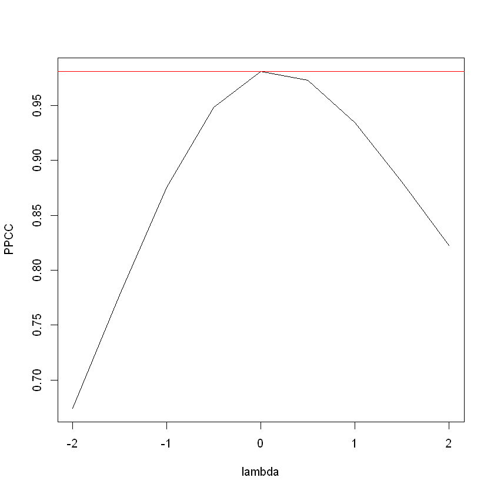
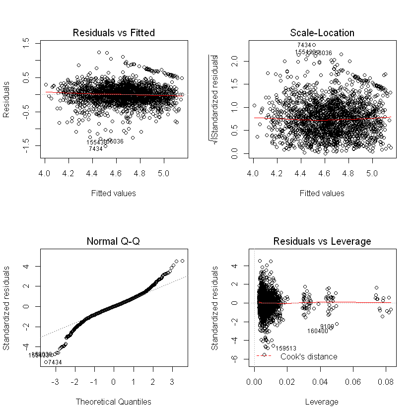
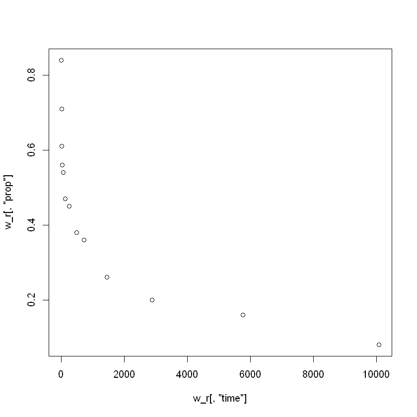

```R
####### Timur Sudak a1277687 ##################################
install.packages("nlme",repos = "http://cran.us.r-project.org")
install.packages("ISLR",repos = "http://cran.us.r-project.org")
install.packages("dummy",repos = "http://cran.us.r-project.org")
install.packages("MASS",repos = "http://cran.us.r-project.org")
install.packages("qqtest",repos = "http://cran.us.r-project.org")
install.packages("caret",repos = "http://cran.us.r-project.org")
install.packages("hydroGOF",repos = "http://cran.us.r-project.org")
install.packages("data.table",repos = "http://cran.us.r-project.org")
install.packages("leaps",repos = "http://cran.us.r-project.org")
install.packages('VIF',repos = "http://cran.us.r-project.org")
install.packages("rpart",repos = "http://cran.us.r-project.org")
install.packages("randomForest",repos = "http://cran.us.r-project.org")
install.packages("olsrr",repos = "http://cran.us.r-project.org")
install.packages("fmsb",repos = "http://cran.us.r-project.org")  
install.packages("forecast",repos = "http://cran.us.r-project.org")
install.packages("ridge",repos = "http://cran.us.r-project.org")
install.packages("car",repos = "http://cran.us.r-project.org")
install.packages("xlsx",repos = "http://cran.us.r-project.org")
```

    Installing package into 'C:/Users/User/Documents/R/win-library/3.4'
    (as 'lib' is unspecified)
    Warning message:
    "package 'nlme' is in use and will not be installed"Installing package into 'C:/Users/User/Documents/R/win-library/3.4'
    (as 'lib' is unspecified)
    Warning message:
    "package 'ISLR' is in use and will not be installed"Installing package into 'C:/Users/User/Documents/R/win-library/3.4'
    (as 'lib' is unspecified)
    Warning message:
    "package 'dummy' is in use and will not be installed"Installing package into 'C:/Users/User/Documents/R/win-library/3.4'
    (as 'lib' is unspecified)
    Warning message:
    "package 'MASS' is in use and will not be installed"Installing package into 'C:/Users/User/Documents/R/win-library/3.4'
    (as 'lib' is unspecified)
    Warning message:
    "package 'qqtest' is in use and will not be installed"Installing package into 'C:/Users/User/Documents/R/win-library/3.4'
    (as 'lib' is unspecified)
    Warning message:
    "package 'caret' is in use and will not be installed"Installing package into 'C:/Users/User/Documents/R/win-library/3.4'
    (as 'lib' is unspecified)
    Warning message:
    "package 'hydroGOF' is in use and will not be installed"Installing package into 'C:/Users/User/Documents/R/win-library/3.4'
    (as 'lib' is unspecified)
    Warning message:
    "package 'data.table' is in use and will not be installed"Installing package into 'C:/Users/User/Documents/R/win-library/3.4'
    (as 'lib' is unspecified)
    Warning message:
    "package 'leaps' is in use and will not be installed"Installing package into 'C:/Users/User/Documents/R/win-library/3.4'
    (as 'lib' is unspecified)
    Warning message:
    "package 'VIF' is in use and will not be installed"Installing package into 'C:/Users/User/Documents/R/win-library/3.4'
    (as 'lib' is unspecified)
    Warning message:
    "package 'rpart' is in use and will not be installed"Installing package into 'C:/Users/User/Documents/R/win-library/3.4'
    (as 'lib' is unspecified)
    Warning message:
    "package 'randomForest' is in use and will not be installed"Installing package into 'C:/Users/User/Documents/R/win-library/3.4'
    (as 'lib' is unspecified)
    Warning message:
    "package 'olsrr' is in use and will not be installed"Installing package into 'C:/Users/User/Documents/R/win-library/3.4'
    (as 'lib' is unspecified)
    Warning message:
    "package 'fmsb' is in use and will not be installed"Installing package into 'C:/Users/User/Documents/R/win-library/3.4'
    (as 'lib' is unspecified)
    Warning message:
    "package 'forecast' is in use and will not be installed"Installing package into 'C:/Users/User/Documents/R/win-library/3.4'
    (as 'lib' is unspecified)
    Warning message:
    "package 'ridge' is in use and will not be installed"Installing package into 'C:/Users/User/Documents/R/win-library/3.4'
    (as 'lib' is unspecified)
    Warning message:
    "package 'car' is in use and will not be installed"Installing package into 'C:/Users/User/Documents/R/win-library/3.4'
    (as 'lib' is unspecified)
    

    package 'xlsx' successfully unpacked and MD5 sums checked
    
    The downloaded binary packages are in
    	C:\Users\User\AppData\Local\Temp\RtmpKq8TcV\downloaded_packages
    


```R
library("randomForest")
library("rpart")
library("VIF")
library("leaps")
library("data.table")
library("MASS")
library("hydroGOF")
library("ISLR")
library("qqtest")
library("nlme")
library("caret")
library("dummy")
library("olsrr")
library("fmsb")
library("forecast")
library("ridge")
library("car")
library("xlsx")
```

    Loading required package: rJava
    Loading required package: xlsxjars
    


```R
setwd("C:/Users/User/Documents/Data for R/Going through Timw Series/Projects in time series/from Nastia")
ant_d = read.csv("Anti-Depressiva.csv", header=TRUE, sep= ";")
ant_d
```


<table>
<thead><tr><th scope=col>y</th><th scope=col>age</th><th scope=col>TRT</th></tr></thead>
<tbody>
	<tr><td>56</td><td>21</td><td>A </td></tr>
	<tr><td>41</td><td>23</td><td>B </td></tr>
	<tr><td>40</td><td>30</td><td>B </td></tr>
	<tr><td>28</td><td>19</td><td>C </td></tr>
	<tr><td>55</td><td>28</td><td>A </td></tr>
	<tr><td>25</td><td>23</td><td>C </td></tr>
	<tr><td>46</td><td>33</td><td>B </td></tr>
	<tr><td>71</td><td>67</td><td>C </td></tr>
	<tr><td>48</td><td>42</td><td>B </td></tr>
	<tr><td>63</td><td>33</td><td>A </td></tr>
	<tr><td>52</td><td>33</td><td>A </td></tr>
	<tr><td>62</td><td>56</td><td>C </td></tr>
	<tr><td>50</td><td>45</td><td>C </td></tr>
	<tr><td>45</td><td>43</td><td>B </td></tr>
	<tr><td>58</td><td>38</td><td>A </td></tr>
	<tr><td>46</td><td>37</td><td>C </td></tr>
	<tr><td>58</td><td>43</td><td>B </td></tr>
	<tr><td>34</td><td>27</td><td>C </td></tr>
	<tr><td>65</td><td>43</td><td>A </td></tr>
	<tr><td>55</td><td>45</td><td>B </td></tr>
	<tr><td>57</td><td>48</td><td>B </td></tr>
	<tr><td>59</td><td>47</td><td>C </td></tr>
	<tr><td>64</td><td>48</td><td>A </td></tr>
	<tr><td>61</td><td>53</td><td>A </td></tr>
	<tr><td>62</td><td>58</td><td>B </td></tr>
	<tr><td>36</td><td>29</td><td>C </td></tr>
	<tr><td>69</td><td>53</td><td>A </td></tr>
	<tr><td>47</td><td>29</td><td>B </td></tr>
	<tr><td>73</td><td>58</td><td>A </td></tr>
	<tr><td>64</td><td>66</td><td>B </td></tr>
	<tr><td>60</td><td>67</td><td>B </td></tr>
	<tr><td>62</td><td>63</td><td>A </td></tr>
	<tr><td>71</td><td>59</td><td>C </td></tr>
	<tr><td>62</td><td>51</td><td>C </td></tr>
	<tr><td>70</td><td>67</td><td>A </td></tr>
	<tr><td>71</td><td>63</td><td>C </td></tr>
</tbody>
</table>


Construct a predictive model with “y” as target variable!
Apply different contrasting strategies and interpret the parameter estimates!
Now we want to do these two points in one exercise.
We will do two contrasting strategies and will fit the model for every strategy.


```R
options(contrasts=c("contr.treatment", "contr.poly"))
contrasts(ant_d[,3])
summary(lm(y~age+TRT, data = ant_d))
```


<table>
<thead><tr><th></th><th scope=col>B</th><th scope=col>C</th></tr></thead>
<tbody>
	<tr><th scope=row>A</th><td>0</td><td>0</td></tr>
	<tr><th scope=row>B</th><td>1</td><td>0</td></tr>
	<tr><th scope=row>C</th><td>0</td><td>1</td></tr>
</tbody>
</table>


    
    Call:
    lm(formula = y ~ age + TRT, data = ant_d)
    
    Residuals:
         Min       1Q   Median       3Q      Max 
    -12.5732  -3.3922   0.9829   3.9613   9.5062 
    
    Coefficients:
                 Estimate Std. Error t value Pr(>|t|)    
    (Intercept)  32.54335    3.58105   9.088 2.23e-10 ***
    age           0.66446    0.06978   9.522 7.42e-11 ***
    TRTB         -9.80758    2.46471  -3.979 0.000371 ***
    TRTC        -10.25276    2.46542  -4.159 0.000224 ***
    ---
    Signif. codes:  0 '***' 0.001 '**' 0.01 '*' 0.05 '.' 0.1 ' ' 1
    
    Residual standard error: 6.035 on 32 degrees of freedom
    Multiple R-squared:  0.784,	Adjusted R-squared:  0.7637 
    F-statistic: 38.71 on 3 and 32 DF,  p-value: 9.287e-11
    


All Coefficients are signifikant at significance level of 0.05. The model explains 76.37 %  of the variation.

Interpretation of the treatment contrast:

For the group A the model would be the baseline. We would get our model for group B if we add our coefficient
TRTB it means that measurement success for group B would be on -9.80758 smaller. And if we add TRTC our measurement success would be smaller on -10.25276 than our baseline.


```R
options(contrasts=c("contr.sum", "contr.poly"))
contrasts(ant_d[,3])
summary(lm(y~age+TRT, data = ant_d))
```


<table>
<tbody>
	<tr><th scope=row>A</th><td> 1</td><td> 0</td></tr>
	<tr><th scope=row>B</th><td> 0</td><td> 1</td></tr>
	<tr><th scope=row>C</th><td>-1</td><td>-1</td></tr>
</tbody>
</table>


    
    Call:
    lm(formula = y ~ age + TRT, data = ant_d)
    
    Residuals:
         Min       1Q   Median       3Q      Max 
    -12.5732  -3.3922   0.9829   3.9613   9.5062 
    
    Coefficients:
                Estimate Std. Error t value Pr(>|t|)    
    (Intercept) 25.85657    3.23845   7.984 4.10e-09 ***
    age          0.66446    0.06978   9.522 7.42e-11 ***
    TRT1         6.68678    1.42341   4.698 4.77e-05 ***
    TRT2        -3.12080    1.42259  -2.194   0.0356 *  
    ---
    Signif. codes:  0 '***' 0.001 '**' 0.01 '*' 0.05 '.' 0.1 ' ' 1
    
    Residual standard error: 6.035 on 32 degrees of freedom
    Multiple R-squared:  0.784,	Adjusted R-squared:  0.7637 
    F-statistic: 38.71 on 3 and 32 DF,  p-value: 9.287e-11
    


 All Coefficients are signifikant at  level of 0.05. The model explains 76.37 %  of the variation.
 
 Interpretation of the sum contrast:

 Intercept is the overall mean across all groups.It means that overall measurement sucess is 25.85657.   The second coefficient is the average slope between overall mean  and age. If we increase age by one unit then our overall mesurement sucess  will increase on 0.66446 across all groups. The coefficient TRT1 is the difference between overall mean and  group 1. Measurement sucess for group 1 would be higher on 6.68678 than our overall measurement sucess.
 And TRT2 coefficient is the difference between overall mean and group 2. Measurement sucess for group 2 would be smaller on -3.12080 than our averall measurement sucess.


Which conclusions do you reach regarding the predictor “TRT”, which indicates three different treatments?

We showed that a predictor TRT does improve our Adjusted R^(2), it means increased explanation of 
the variation. So therefore we have to include this predictor in our model. 


Here we see some examples of three different models and their comparison of Adjusted R2 values:


```R
summary(lm(y~age, data = ant_d)) #Here our Adjusted R2 is 0.624.


```


    
    Call:
    lm(formula = y ~ age, data = ant_d)
    
    Residuals:
         Min       1Q   Median       3Q      Max 
    -15.8916  -5.7463  -0.4105   4.7013  16.4607 
    
    Coefficients:
                Estimate Std. Error t value Pr(>|t|)    
    (Intercept) 25.33935    4.08258   6.207 4.65e-07 ***
    age          0.67619    0.08797   7.687 6.15e-09 ***
    ---
    Signif. codes:  0 '***' 0.001 '**' 0.01 '*' 0.05 '.' 0.1 ' ' 1
    
    Residual standard error: 7.613 on 34 degrees of freedom
    Multiple R-squared:  0.6347,	Adjusted R-squared:  0.624 
    F-statistic: 59.08 on 1 and 34 DF,  p-value: 6.155e-09
    


```R
summary(lm(y~age+TRT, data = ant_d)) # Here our Adjusted R2 is 0.7637. 


```


    
    Call:
    lm(formula = y ~ age + TRT, data = ant_d)
    
    Residuals:
         Min       1Q   Median       3Q      Max 
    -12.5732  -3.3922   0.9829   3.9613   9.5062 
    
    Coefficients:
                Estimate Std. Error t value Pr(>|t|)    
    (Intercept) 25.85657    3.23845   7.984 4.10e-09 ***
    age          0.66446    0.06978   9.522 7.42e-11 ***
    TRT1         6.68678    1.42341   4.698 4.77e-05 ***
    TRT2        -3.12080    1.42259  -2.194   0.0356 *  
    ---
    Signif. codes:  0 '***' 0.001 '**' 0.01 '*' 0.05 '.' 0.1 ' ' 1
    
    Residual standard error: 6.035 on 32 degrees of freedom
    Multiple R-squared:  0.784,	Adjusted R-squared:  0.7637 
    F-statistic: 38.71 on 3 and 32 DF,  p-value: 9.287e-11
    


```R
summary(lm(y~age*TRT, data = ant_d)) # here our Adjusted R2 is 0.9001.

```


    
    Call:
    lm(formula = y ~ age * TRT, data = ant_d)
    
    Residuals:
        Min      1Q  Median      3Q     Max 
    -6.4366 -2.7637  0.1887  2.9075  6.5634 
    
    Coefficients:
                Estimate Std. Error t value Pr(>|t|)    
    (Intercept) 27.54839    2.12264  12.978 7.68e-14 ***
    age          0.62919    0.04574  13.757 1.71e-14 ***
    TRT1        19.96720    3.06317   6.518 3.31e-07 ***
    TRT2         1.36981    3.06673   0.447    0.658    
    age:TRT1    -0.29869    0.06562  -4.552 8.23e-05 ***
    age:TRT2    -0.10551    0.06641  -1.589    0.123    
    ---
    Signif. codes:  0 '***' 0.001 '**' 0.01 '*' 0.05 '.' 0.1 ' ' 1
    
    Residual standard error: 3.925 on 30 degrees of freedom
    Multiple R-squared:  0.9143,	Adjusted R-squared:  0.9001 
    F-statistic: 64.04 on 5 and 30 DF,  p-value: 4.264e-15
    


```R
#Compare and interpret models with and without interaction terms!
einf_mod = lm(y~age+TRT, data = ant_d)
mod_int <-  lm(y~age*TRT, data = ant_d)
summary(mod_int)
```


    
    Call:
    lm(formula = y ~ age * TRT, data = ant_d)
    
    Residuals:
        Min      1Q  Median      3Q     Max 
    -6.4366 -2.7637  0.1887  2.9075  6.5634 
    
    Coefficients:
                Estimate Std. Error t value Pr(>|t|)    
    (Intercept) 27.54839    2.12264  12.978 7.68e-14 ***
    age          0.62919    0.04574  13.757 1.71e-14 ***
    TRT1        19.96720    3.06317   6.518 3.31e-07 ***
    TRT2         1.36981    3.06673   0.447    0.658    
    age:TRT1    -0.29869    0.06562  -4.552 8.23e-05 ***
    age:TRT2    -0.10551    0.06641  -1.589    0.123    
    ---
    Signif. codes:  0 '***' 0.001 '**' 0.01 '*' 0.05 '.' 0.1 ' ' 1
    
    Residual standard error: 3.925 on 30 degrees of freedom
    Multiple R-squared:  0.9143,	Adjusted R-squared:  0.9001 
    F-statistic: 64.04 on 5 and 30 DF,  p-value: 4.264e-15
    


                              This is our model with interaction effects.
Age: if we increase one unit of age our sucess will increase on 0.33051 for all groups.

TRTB: Our Sucess for Group B Would be smaller on -18.59739 than in group A.

TRTC: Our Sucess for Group C would be smaller on -14.30421 than in group A.

age:TRTB: If we increase one unit of age our sucess for group B would be higher on 0.19318.It means that difference betwenn 
group A and B increases on 0.19318.

age:TRTC: If we increase one unit of age our sucess for group C would be higher  on  0.70288. It means that difference betwenn group A and C increases on 0.70288.

All our coefficients are siginificant except of one coefficient age:TRTB.


```R
anova(einf_mod,mod_int) 

```


<table>
<thead><tr><th scope=col>Res.Df</th><th scope=col>RSS</th><th scope=col>Df</th><th scope=col>Sum of Sq</th><th scope=col>F</th><th scope=col>Pr(&gt;F)</th></tr></thead>
<tbody>
	<tr><td>32          </td><td>1165.5747   </td><td>NA          </td><td>     NA     </td><td>      NA    </td><td>          NA</td></tr>
	<tr><td>30          </td><td> 462.1477   </td><td> 2          </td><td>703.427     </td><td>22.83124    </td><td>9.410457e-07</td></tr>
</tbody>
</table>


We see that we have significant difference between two models, our p<0.05. Normally bigger models explain the same amount of variation than smaller model. And in our case because of significance it makes sense to include the interaction term.


```R
#Visualize the data and the different models estimated
plot(ant_d$y ~ ant_d$age, col = as.numeric(ant_d$TRT), pch = 5)
abline(lm(ant_d$y ~ ant_d$age, subset = ant_d$TRT == "A"), col = "black")
abline(lm(ant_d$y ~ ant_d$age, subset = ant_d$TRT == "B"), col = "red")
abline(lm(ant_d$y ~ ant_d$age, subset = ant_d$TRT == "C"), col = "blue")
abline(lm(ant_d$y ~ ant_d$age), lty = 2,col = "yellow")
legend("bottomright", legend = c("A","B","C"), col = c("black", "red", "blue"), lty = rep(1,3))
```





Here we plot models for three different groups. And one plot for the average model.


```R
####################Aufgabe 2 ########################
Wage_c <- Wage[colnames(Wage)[!(colnames(Wage) %in% c("logwage", "region"))]]
set.seed(100)
train_ind <- sample(1:nrow(Wage_c), round(0.7*nrow(Wage_c))) 
Wage_train <- Wage_c[train_ind,] 
Wage_test <- Wage_c[-train_ind,]
```


```R
pr1=lm(wage ~ year+age+maritl+race+education+jobclass+health+health_ins, data=Wage_train) # This is our OLS model.
summary(pr1)
```


    
    Call:
    lm(formula = wage ~ year + age + maritl + race + education + 
        jobclass + health + health_ins, data = Wage_train)
    
    Residuals:
       Min     1Q Median     3Q    Max 
    -96.12 -18.53  -3.30  12.98 212.21 
    
    Coefficients:
                  Estimate Std. Error t value Pr(>|t|)    
    (Intercept) -2.397e+03  7.327e+02  -3.271  0.00109 ** 
    year         1.236e+00  3.653e-01   3.383  0.00073 ***
    age          3.683e-01  7.285e-02   5.056 4.66e-07 ***
    maritl1     -6.581e+00  2.644e+00  -2.489  0.01290 *  
    maritl2      1.082e+01  2.322e+00   4.657 3.41e-06 ***
    maritl3     -6.211e+00  7.307e+00  -0.850  0.39538    
    maritl4     -1.457e+00  3.105e+00  -0.469  0.63893    
    race1        4.920e+00  2.027e+00   2.427  0.01529 *  
    race2       -2.536e+00  2.598e+00  -0.976  0.32916    
    race3        2.359e+00  2.898e+00   0.814  0.41580    
    education1  -2.256e+01  2.109e+00 -10.699  < 2e-16 ***
    education2  -1.498e+01  1.324e+00 -11.314  < 2e-16 ***
    education3  -4.006e+00  1.489e+00  -2.691  0.00717 ** 
    education4   1.037e+01  1.446e+00   7.175 9.99e-13 ***
    jobclass1   -1.592e+00  7.814e-01  -2.037  0.04178 *  
    health1     -4.452e+00  8.444e-01  -5.272 1.49e-07 ***
    health_ins1  7.896e+00  8.195e-01   9.636  < 2e-16 ***
    ---
    Signif. codes:  0 '***' 0.001 '**' 0.01 '*' 0.05 '.' 0.1 ' ' 1
    
    Residual standard error: 33.52 on 2083 degrees of freedom
    Multiple R-squared:  0.359,	Adjusted R-squared:  0.3541 
    F-statistic: 72.91 on 16 and 2083 DF,  p-value: < 2.2e-16
    


At first we train our model. In this case we get OLS. Then we will compare different models with different transformation
in OLS and another methods.


```R
plot(Wage_train)
```





We have to give attention to the predictors with some correlation. Because we can include them in the model as interaction terms


```R
pr2=lm(wage ~ year*age+maritl+race*age+education*age+jobclass+health+health_ins, data=Wage_train) 
summary(pr2)
```


    
    Call:
    lm(formula = wage ~ year * age + maritl + race * age + education * 
        age + jobclass + health + health_ins, data = Wage_train)
    
    Residuals:
         Min       1Q   Median       3Q      Max 
    -100.106  -18.378   -3.285   12.994  210.709 
    
    Coefficients:
                     Estimate Std. Error t value Pr(>|t|)    
    (Intercept)    -4.863e+03  2.734e+03  -1.779   0.0754 .  
    year            2.464e+00  1.363e+00   1.808   0.0707 .  
    age             5.600e+01  6.150e+01   0.911   0.3626    
    maritl1        -6.666e+00  2.648e+00  -2.518   0.0119 *  
    maritl2         1.097e+01  2.333e+00   4.700 2.77e-06 ***
    maritl3        -6.461e+00  7.344e+00  -0.880   0.3790    
    maritl4        -1.889e+00  3.110e+00  -0.607   0.5436    
    race1           5.266e+00  6.977e+00   0.755   0.4505    
    race2           4.006e+00  8.961e+00   0.447   0.6549    
    race3           1.166e+01  1.048e+01   1.112   0.2661    
    education1     -6.523e+00  7.144e+00  -0.913   0.3613    
    education2     -5.265e+00  4.831e+00  -1.090   0.2759    
    education3     -1.364e+01  5.476e+00  -2.490   0.0128 *  
    education4      1.317e+01  5.621e+00   2.343   0.0192 *  
    jobclass1      -1.632e+00  7.813e-01  -2.089   0.0369 *  
    health1        -4.356e+00  8.437e-01  -5.163 2.66e-07 ***
    health_ins1     8.111e+00  8.238e-01   9.846  < 2e-16 ***
    year:age       -2.770e-02  3.066e-02  -0.903   0.3664    
    age:race1      -2.674e-02  1.732e-01  -0.154   0.8773    
    age:race2      -1.570e-01  2.095e-01  -0.750   0.4535    
    age:race3      -2.312e-01  2.509e-01  -0.922   0.3569    
    age:education1 -3.770e-01  1.645e-01  -2.292   0.0220 *  
    age:education2 -2.220e-01  1.089e-01  -2.038   0.0417 *  
    age:education3  2.424e-01  1.272e-01   1.906   0.0568 .  
    age:education4 -6.085e-02  1.268e-01  -0.480   0.6312    
    ---
    Signif. codes:  0 '***' 0.001 '**' 0.01 '*' 0.05 '.' 0.1 ' ' 1
    
    Residual standard error: 33.44 on 2075 degrees of freedom
    Multiple R-squared:  0.3644,	Adjusted R-squared:  0.3571 
    F-statistic: 49.57 on 24 and 2075 DF,  p-value: < 2.2e-16
    


Here i tried to trnasform variables with including of interaction terms. I choosed variables with the biggest correlation.
But it didn't improve our model so well. We could also do some Polynomial or log distribution but as we see below it doesn't make so much sense because our data doesn't show any non-linearities.


```R
layout(matrix(c(1,2,3,4),2,2)) 
plot(pr1)
```





As we can conclude from this plots there are no non-linearities.


```R
pd_pr1 = predict(pr1, newdata=Wage_test) # Here we get fitted values.
rss_ols = mean((Wage_test[,"wage"]-pd_pr1)^(2)) # Here we get our Av. RSS for OLS.
rss_ols
```


1244.23861249978


Here we compute average RSS for different methods and compare them. As we showed above it doesn't make so much sense to transform something or add some interactions we will use just our classic models with predictors.


```R
# For the regression Tree.

set.seed(100)
rg_tree = rpart(wage ~ .,Wage_train, cp = 0.0001)
printcp(rg_tree)
regression_trees_pred <- predict(rg_tree, Wage_test)
rss_reg_tree <- mean((Wage_test$wage - regression_trees_pred)^(2))

```

    
    Regression tree:
    rpart(formula = wage ~ ., data = Wage_train, cp = 1e-04)
    
    Variables actually used in tree construction:
    [1] age        education  health     health_ins jobclass   maritl     race      
    [8] year      
    
    Root node error: 3651382/2100 = 1738.8
    
    n= 2100 
    
                CP nsplit rel error  xerror     xstd
    1   0.19381157      0   1.00000 1.00036 0.056314
    2   0.03370416      1   0.80619 0.80702 0.047707
    3   0.03067754      2   0.77248 0.79504 0.047004
    4   0.02520473      3   0.74181 0.75773 0.046298
    5   0.01196640      4   0.71660 0.73614 0.045176
    6   0.01138937      5   0.70464 0.72493 0.044394
    7   0.01054834      6   0.69325 0.71668 0.043994
    8   0.00988937      7   0.68270 0.70844 0.043530
    9   0.00672986      8   0.67281 0.69165 0.042369
    10  0.00641096      9   0.66608 0.70835 0.043516
    11  0.00616113     10   0.65967 0.70803 0.043567
    12  0.00613904     11   0.65351 0.70706 0.043240
    13  0.00542195     12   0.64737 0.70479 0.043237
    14  0.00444838     13   0.64195 0.70821 0.043181
    15  0.00398366     15   0.63305 0.70483 0.042708
    16  0.00318517     18   0.62110 0.70918 0.042615
    17  0.00301145     19   0.61791 0.71409 0.042981
    18  0.00294012     20   0.61490 0.71549 0.043004
    19  0.00282265     21   0.61196 0.71466 0.042964
    20  0.00280584     22   0.60914 0.71492 0.042927
    21  0.00280182     23   0.60633 0.71533 0.043011
    22  0.00257733     24   0.60353 0.71566 0.043587
    23  0.00252145     26   0.59838 0.71335 0.043264
    24  0.00208332     27   0.59585 0.71169 0.043089
    25  0.00208298     28   0.59377 0.71172 0.042803
    26  0.00201661     31   0.58752 0.71254 0.042840
    27  0.00200318     32   0.58551 0.71167 0.042754
    28  0.00196545     33   0.58350 0.71302 0.042808
    29  0.00194012     34   0.58154 0.71464 0.042830
    30  0.00193088     35   0.57960 0.71420 0.042831
    31  0.00177856     36   0.57767 0.71325 0.042700
    32  0.00175343     39   0.57233 0.71283 0.042472
    33  0.00174754     40   0.57058 0.71321 0.042457
    34  0.00174337     42   0.56708 0.71321 0.042457
    35  0.00155719     43   0.56534 0.71457 0.042542
    36  0.00150007     44   0.56378 0.71186 0.042321
    37  0.00142720     45   0.56228 0.71552 0.042511
    38  0.00127835     46   0.56085 0.71719 0.042788
    39  0.00124639     47   0.55958 0.71827 0.042776
    40  0.00109863     51   0.55451 0.72146 0.042853
    41  0.00107530     52   0.55341 0.72224 0.043138
    42  0.00106223     55   0.55019 0.72295 0.043258
    43  0.00105951     57   0.54806 0.72341 0.043320
    44  0.00101140     61   0.54383 0.72163 0.043242
    45  0.00099642     62   0.54281 0.72024 0.042928
    46  0.00092972     63   0.54182 0.72219 0.042978
    47  0.00087672     64   0.54089 0.72461 0.042791
    48  0.00085559     65   0.54001 0.72519 0.042846
    49  0.00083731     66   0.53916 0.72503 0.043003
    50  0.00083558     67   0.53832 0.72610 0.043006
    51  0.00082468     69   0.53665 0.72819 0.043572
    52  0.00080748     71   0.53500 0.72961 0.043610
    53  0.00078445     75   0.53177 0.73051 0.043613
    54  0.00076312     76   0.53098 0.73107 0.043500
    55  0.00074276     77   0.53022 0.73130 0.043489
    56  0.00074179     78   0.52948 0.73149 0.043457
    57  0.00074147     80   0.52799 0.73149 0.043457
    58  0.00073994     82   0.52651 0.73149 0.043457
    59  0.00073859     83   0.52577 0.73149 0.043457
    60  0.00072296     85   0.52429 0.73147 0.043410
    61  0.00072131     86   0.52357 0.73088 0.043401
    62  0.00068136     87   0.52285 0.73083 0.043331
    63  0.00064977     89   0.52149 0.73130 0.043367
    64  0.00063918     90   0.52084 0.73236 0.043370
    65  0.00063039     91   0.52020 0.73327 0.043398
    66  0.00058456     95   0.51768 0.73456 0.043469
    67  0.00058054     96   0.51709 0.73671 0.043548
    68  0.00054523     97   0.51651 0.73596 0.043547
    69  0.00054403     98   0.51597 0.73606 0.043524
    70  0.00053333     99   0.51542 0.73579 0.043526
    71  0.00048176    100   0.51489 0.73600 0.043511
    72  0.00047026    102   0.51393 0.73667 0.043508
    73  0.00045510    104   0.51299 0.73814 0.043489
    74  0.00043915    105   0.51253 0.73933 0.043492
    75  0.00043408    106   0.51209 0.74041 0.043598
    76  0.00042326    107   0.51166 0.74102 0.043606
    77  0.00042008    108   0.51123 0.74083 0.043605
    78  0.00041963    110   0.51039 0.74068 0.043603
    79  0.00040423    112   0.50955 0.74113 0.043607
    80  0.00037557    113   0.50915 0.74136 0.043609
    81  0.00037384    114   0.50877 0.74156 0.043566
    82  0.00035636    115   0.50840 0.74196 0.043562
    83  0.00035153    118   0.50733 0.74298 0.043634
    84  0.00034988    119   0.50698 0.74263 0.043556
    85  0.00034281    120   0.50663 0.74263 0.043505
    86  0.00032487    121   0.50629 0.74223 0.043457
    87  0.00032477    122   0.50596 0.74185 0.043462
    88  0.00032055    123   0.50564 0.74195 0.043461
    89  0.00032030    124   0.50532 0.74164 0.043457
    90  0.00031707    127   0.50436 0.74171 0.043457
    91  0.00030662    128   0.50404 0.74284 0.043497
    92  0.00029932    130   0.50343 0.74295 0.043497
    93  0.00028520    131   0.50313 0.74291 0.043495
    94  0.00027933    133   0.50256 0.74313 0.043498
    95  0.00027687    135   0.50200 0.74325 0.043498
    96  0.00027125    136   0.50172 0.74342 0.043498
    97  0.00026763    137   0.50145 0.74353 0.043499
    98  0.00026715    138   0.50118 0.74334 0.043497
    99  0.00025321    140   0.50065 0.74374 0.043691
    100 0.00023762    141   0.50039 0.74329 0.043653
    101 0.00021147    142   0.50016 0.74375 0.043696
    102 0.00020956    143   0.49995 0.74362 0.043626
    103 0.00020311    145   0.49953 0.74388 0.043629
    104 0.00019686    146   0.49932 0.74360 0.043604
    105 0.00018839    147   0.49913 0.74328 0.043502
    106 0.00018108    149   0.49875 0.74397 0.043502
    107 0.00017827    151   0.49839 0.74431 0.043503
    108 0.00017124    153   0.49803 0.74427 0.043504
    109 0.00016543    154   0.49786 0.74395 0.043487
    110 0.00015716    155   0.49769 0.74416 0.043485
    111 0.00015493    156   0.49754 0.74475 0.043491
    112 0.00015433    158   0.49723 0.74475 0.043492
    113 0.00014058    159   0.49707 0.74461 0.043492
    114 0.00013793    160   0.49693 0.74507 0.043497
    115 0.00013493    161   0.49679 0.74468 0.043487
    116 0.00012945    162   0.49666 0.74426 0.043456
    117 0.00012652    163   0.49653 0.74432 0.043457
    118 0.00012552    164   0.49640 0.74424 0.043457
    119 0.00011952    165   0.49628 0.74411 0.043463
    120 0.00011244    166   0.49616 0.74412 0.043463
    121 0.00010196    167   0.49605 0.74422 0.043462
    122 0.00010000    168   0.49594 0.74430 0.043462
    


```R
plotcp(rg_tree)
```





How we see from the table and the graph that it makes sense to take  0.00208298 cp. Because as our cp decreases after this cp our xerror increases. 


```R
set.seed(100)
rg_tree = rpart(wage ~ .,Wage_train, cp = 0.00208298)
regression_trees_pred <- predict(rg_tree, Wage_test)
rss_reg_tree <- mean((Wage_test$wage - regression_trees_pred)^(2))
rss_reg_tree
```


1328.16261410069


This is our average RSS for the Regression Tree.


```R
### Random Forest.
rnd_forest_md = randomForest(wage~ ., Wage_train, ntree=50, norm.votes=FALSE)
prd_ranfor = predict(rnd_forest_md, Wage_test)
mean((Wage_test$wage-prd_ranfor)^(2)) 
```


1253.4966565669


As we know that in Random Forest the more trees we do the better model we get. Now we will try different numbers of trees to check whether it makes a big difference to make number of tree real big.


```R
rnd_forest_md = randomForest(wage~ ., Wage_train, ntree=100, norm.votes=FALSE)
prd_ranfor = predict(rnd_forest_md, Wage_test)
mean((Wage_test$wage-prd_ranfor)^(2))
```


1246.05387203512


```R

rnd_forest_md = randomForest(wage~ ., Wage_train, ntree=3000, norm.votes=FALSE)
prd_ranfor = predict(rnd_forest_md, Wage_test)
mean((Wage_test$wage-prd_ranfor)^(2))
```


1239.65822298803


As we see that influence of the number of the trees for our average RSS is not so big. We needed 3000 Trees to get our average less than 
OLS. Therefore i think that some average number of trees  for our model would be enough.


                          ############################Aufgabe 3 ##################################


```R
r_est = read.table("realestate.txt", header=TRUE) # Real Estate
r_est
```


<table>
<thead><tr><th scope=col>SalesPrice</th><th scope=col>SqFeet</th><th scope=col>Beds</th><th scope=col>Baths</th><th scope=col>AirCond</th><th scope=col>Garage</th><th scope=col>Pool</th><th scope=col>Year</th><th scope=col>Quality</th><th scope=col>Style</th><th scope=col>Lot</th><th scope=col>Highway</th></tr></thead>
<tbody>
	<tr><td>360.00</td><td>3.032 </td><td>4     </td><td>4     </td><td>1     </td><td>2     </td><td>0     </td><td>1972  </td><td>2     </td><td>1     </td><td>22.221</td><td>0     </td></tr>
	<tr><td>340.00</td><td>2.058 </td><td>4     </td><td>2     </td><td>1     </td><td>2     </td><td>0     </td><td>1976  </td><td>2     </td><td>1     </td><td>22.912</td><td>0     </td></tr>
	<tr><td>250.00</td><td>1.780 </td><td>4     </td><td>3     </td><td>1     </td><td>2     </td><td>0     </td><td>1980  </td><td>2     </td><td>1     </td><td>21.345</td><td>0     </td></tr>
	<tr><td>205.50</td><td>1.638 </td><td>4     </td><td>2     </td><td>1     </td><td>2     </td><td>0     </td><td>1963  </td><td>2     </td><td>1     </td><td>17.342</td><td>0     </td></tr>
	<tr><td>275.50</td><td>2.196 </td><td>4     </td><td>3     </td><td>1     </td><td>2     </td><td>0     </td><td>1968  </td><td>2     </td><td>7     </td><td>21.786</td><td>0     </td></tr>
	<tr><td>248.00</td><td>1.966 </td><td>4     </td><td>3     </td><td>1     </td><td>5     </td><td>1     </td><td>1972  </td><td>2     </td><td>1     </td><td>18.902</td><td>0     </td></tr>
	<tr><td>229.90</td><td>2.216 </td><td>3     </td><td>2     </td><td>1     </td><td>2     </td><td>0     </td><td>1972  </td><td>2     </td><td>7     </td><td>18.639</td><td>0     </td></tr>
	<tr><td>150.00</td><td>1.597 </td><td>2     </td><td>1     </td><td>1     </td><td>1     </td><td>0     </td><td>1955  </td><td>2     </td><td>1     </td><td>22.112</td><td>0     </td></tr>
	<tr><td>195.00</td><td>1.622 </td><td>3     </td><td>2     </td><td>1     </td><td>2     </td><td>0     </td><td>1975  </td><td>3     </td><td>1     </td><td>14.321</td><td>0     </td></tr>
	<tr><td>160.00</td><td>1.976 </td><td>3     </td><td>3     </td><td>0     </td><td>1     </td><td>0     </td><td>1918  </td><td>3     </td><td>1     </td><td>32.358</td><td>0     </td></tr>
	<tr><td>190.00</td><td>2.812 </td><td>7     </td><td>5     </td><td>0     </td><td>2     </td><td>1     </td><td>1966  </td><td>3     </td><td>7     </td><td>56.639</td><td>0     </td></tr>
	<tr><td>559.00</td><td>2.791 </td><td>3     </td><td>4     </td><td>1     </td><td>3     </td><td>0     </td><td>1992  </td><td>1     </td><td>1     </td><td>30.595</td><td>0     </td></tr>
	<tr><td>535.00</td><td>3.381 </td><td>5     </td><td>4     </td><td>1     </td><td>3     </td><td>0     </td><td>1988  </td><td>1     </td><td>7     </td><td>23.172</td><td>0     </td></tr>
	<tr><td>525.00</td><td>3.459 </td><td>5     </td><td>4     </td><td>1     </td><td>2     </td><td>0     </td><td>1978  </td><td>1     </td><td>5     </td><td>35.351</td><td>0     </td></tr>
	<tr><td>299.90</td><td>2.090 </td><td>3     </td><td>3     </td><td>1     </td><td>2     </td><td>0     </td><td>1987  </td><td>2     </td><td>1     </td><td>24.025</td><td>0     </td></tr>
	<tr><td>527.00</td><td>3.232 </td><td>5     </td><td>5     </td><td>1     </td><td>2     </td><td>0     </td><td>1984  </td><td>2     </td><td>6     </td><td>21.445</td><td>0     </td></tr>
	<tr><td>169.90</td><td>1.502 </td><td>2     </td><td>2     </td><td>1     </td><td>2     </td><td>0     </td><td>1956  </td><td>2     </td><td>1     </td><td>28.958</td><td>0     </td></tr>
	<tr><td>335.25</td><td>2.747 </td><td>3     </td><td>4     </td><td>1     </td><td>2     </td><td>0     </td><td>1993  </td><td>2     </td><td>7     </td><td>22.241</td><td>0     </td></tr>
	<tr><td>323.90</td><td>2.890 </td><td>4     </td><td>3     </td><td>1     </td><td>2     </td><td>0     </td><td>1954  </td><td>2     </td><td>7     </td><td>41.992</td><td>0     </td></tr>
	<tr><td>200.00</td><td>1.825 </td><td>3     </td><td>3     </td><td>1     </td><td>2     </td><td>0     </td><td>1957  </td><td>2     </td><td>1     </td><td>30.266</td><td>0     </td></tr>
	<tr><td>211.00</td><td>1.578 </td><td>4     </td><td>3     </td><td>1     </td><td>2     </td><td>0     </td><td>1986  </td><td>2     </td><td>2     </td><td>18.829</td><td>0     </td></tr>
	<tr><td>212.00</td><td>1.763 </td><td>3     </td><td>3     </td><td>1     </td><td>2     </td><td>0     </td><td>1959  </td><td>2     </td><td>1     </td><td>24.726</td><td>0     </td></tr>
	<tr><td>245.00</td><td>2.517 </td><td>4     </td><td>3     </td><td>1     </td><td>2     </td><td>0     </td><td>1965  </td><td>2     </td><td>1     </td><td>23.261</td><td>0     </td></tr>
	<tr><td>140.40</td><td>1.872 </td><td>3     </td><td>2     </td><td>1     </td><td>2     </td><td>0     </td><td>1985  </td><td>2     </td><td>3     </td><td>24.017</td><td>0     </td></tr>
	<tr><td>295.00</td><td>3.266 </td><td>3     </td><td>3     </td><td>1     </td><td>2     </td><td>0     </td><td>1908  </td><td>2     </td><td>6     </td><td>24.881</td><td>0     </td></tr>
	<tr><td>170.90</td><td>2.020 </td><td>1     </td><td>2     </td><td>1     </td><td>1     </td><td>0     </td><td>1956  </td><td>2     </td><td>1     </td><td>21.385</td><td>0     </td></tr>
	<tr><td>229.00</td><td>2.164 </td><td>4     </td><td>2     </td><td>1     </td><td>2     </td><td>0     </td><td>1965  </td><td>2     </td><td>1     </td><td>28.291</td><td>0     </td></tr>
	<tr><td>218.50</td><td>2.080 </td><td>3     </td><td>2     </td><td>1     </td><td>2     </td><td>1     </td><td>1959  </td><td>2     </td><td>1     </td><td>14.752</td><td>0     </td></tr>
	<tr><td>160.00</td><td>2.208 </td><td>2     </td><td>2     </td><td>1     </td><td>2     </td><td>0     </td><td>1985  </td><td>2     </td><td>7     </td><td> 8.058</td><td>0     </td></tr>
	<tr><td>259.00</td><td>3.048 </td><td>6     </td><td>4     </td><td>1     </td><td>3     </td><td>0     </td><td>1960  </td><td>2     </td><td>7     </td><td>29.307</td><td>0     </td></tr>
	<tr><td>...</td><td>...</td><td>...</td><td>...</td><td>...</td><td>...</td><td>...</td><td>...</td><td>...</td><td>...</td><td>...</td><td>...</td></tr>
	<tr><td>175.00</td><td>2.035 </td><td>4     </td><td>2     </td><td>1     </td><td>3     </td><td>0     </td><td>1962  </td><td>3     </td><td>7     </td><td>20.131</td><td>0     </td></tr>
	<tr><td>147.00</td><td>1.534 </td><td>3     </td><td>2     </td><td>0     </td><td>1     </td><td>0     </td><td>1955  </td><td>3     </td><td>3     </td><td>15.361</td><td>0     </td></tr>
	<tr><td>155.00</td><td>1.624 </td><td>2     </td><td>2     </td><td>1     </td><td>2     </td><td>0     </td><td>1955  </td><td>3     </td><td>1     </td><td>16.721</td><td>0     </td></tr>
	<tr><td>150.00</td><td>1.700 </td><td>4     </td><td>2     </td><td>1     </td><td>1     </td><td>0     </td><td>1954  </td><td>3     </td><td>1     </td><td>15.391</td><td>0     </td></tr>
	<tr><td>165.00</td><td>1.630 </td><td>3     </td><td>2     </td><td>1     </td><td>2     </td><td>0     </td><td>1978  </td><td>3     </td><td>2     </td><td>24.963</td><td>0     </td></tr>
	<tr><td>147.00</td><td>1.526 </td><td>3     </td><td>2     </td><td>1     </td><td>1     </td><td>0     </td><td>1957  </td><td>3     </td><td>1     </td><td>15.007</td><td>0     </td></tr>
	<tr><td>146.25</td><td>1.672 </td><td>3     </td><td>1     </td><td>1     </td><td>2     </td><td>0     </td><td>1949  </td><td>3     </td><td>1     </td><td>22.617</td><td>0     </td></tr>
	<tr><td>177.50</td><td>1.588 </td><td>4     </td><td>2     </td><td>1     </td><td>2     </td><td>0     </td><td>1980  </td><td>3     </td><td>2     </td><td>21.925</td><td>0     </td></tr>
	<tr><td>153.65</td><td>1.752 </td><td>4     </td><td>2     </td><td>1     </td><td>2     </td><td>0     </td><td>1950  </td><td>3     </td><td>6     </td><td> 9.126</td><td>0     </td></tr>
	<tr><td>199.50</td><td>1.674 </td><td>4     </td><td>2     </td><td>0     </td><td>2     </td><td>0     </td><td>1947  </td><td>3     </td><td>1     </td><td>33.237</td><td>0     </td></tr>
	<tr><td>186.00</td><td>1.980 </td><td>3     </td><td>1     </td><td>0     </td><td>1     </td><td>0     </td><td>1927  </td><td>3     </td><td>6     </td><td>47.679</td><td>0     </td></tr>
	<tr><td>139.90</td><td>1.396 </td><td>1     </td><td>1     </td><td>0     </td><td>2     </td><td>0     </td><td>1950  </td><td>3     </td><td>1     </td><td>25.879</td><td>0     </td></tr>
	<tr><td>160.00</td><td>1.178 </td><td>1     </td><td>1     </td><td>0     </td><td>2     </td><td>0     </td><td>1959  </td><td>3     </td><td>1     </td><td> 9.941</td><td>0     </td></tr>
	<tr><td>125.00</td><td>1.263 </td><td>2     </td><td>2     </td><td>0     </td><td>0     </td><td>0     </td><td>1955  </td><td>3     </td><td>1     </td><td>12.357</td><td>0     </td></tr>
	<tr><td>359.90</td><td>2.377 </td><td>5     </td><td>2     </td><td>1     </td><td>2     </td><td>0     </td><td>1937  </td><td>3     </td><td>6     </td><td>51.005</td><td>0     </td></tr>
	<tr><td>184.50</td><td>1.304 </td><td>3     </td><td>1     </td><td>1     </td><td>2     </td><td>0     </td><td>1951  </td><td>3     </td><td>1     </td><td>21.305</td><td>0     </td></tr>
	<tr><td>155.00</td><td>1.340 </td><td>3     </td><td>1     </td><td>0     </td><td>0     </td><td>0     </td><td>1952  </td><td>3     </td><td>1     </td><td> 5.666</td><td>0     </td></tr>
	<tr><td>150.00</td><td>1.559 </td><td>2     </td><td>1     </td><td>0     </td><td>2     </td><td>0     </td><td>1952  </td><td>3     </td><td>1     </td><td>23.999</td><td>0     </td></tr>
	<tr><td>146.00</td><td>1.412 </td><td>1     </td><td>2     </td><td>1     </td><td>0     </td><td>0     </td><td>1920  </td><td>3     </td><td>1     </td><td> 4.560</td><td>0     </td></tr>
	<tr><td>129.00</td><td>1.198 </td><td>2     </td><td>2     </td><td>1     </td><td>2     </td><td>0     </td><td>1925  </td><td>3     </td><td>1     </td><td>20.918</td><td>0     </td></tr>
	<tr><td>145.00</td><td>1.424 </td><td>2     </td><td>1     </td><td>1     </td><td>2     </td><td>0     </td><td>1947  </td><td>3     </td><td>1     </td><td>16.414</td><td>0     </td></tr>
	<tr><td>200.00</td><td>1.370 </td><td>4     </td><td>1     </td><td>0     </td><td>1     </td><td>0     </td><td>1925  </td><td>3     </td><td>4     </td><td> 8.000</td><td>0     </td></tr>
	<tr><td>149.90</td><td>1.584 </td><td>3     </td><td>2     </td><td>1     </td><td>2     </td><td>0     </td><td>1957  </td><td>3     </td><td>1     </td><td>13.514</td><td>0     </td></tr>
	<tr><td>132.00</td><td>1.567 </td><td>2     </td><td>1     </td><td>1     </td><td>1     </td><td>0     </td><td>1934  </td><td>3     </td><td>4     </td><td>12.249</td><td>0     </td></tr>
	<tr><td>136.90</td><td>1.409 </td><td>2     </td><td>1     </td><td>0     </td><td>1     </td><td>0     </td><td>1951  </td><td>3     </td><td>1     </td><td>28.421</td><td>0     </td></tr>
	<tr><td>137.00</td><td>1.655 </td><td>2     </td><td>1     </td><td>0     </td><td>1     </td><td>0     </td><td>1935  </td><td>3     </td><td>1     </td><td>54.651</td><td>0     </td></tr>
	<tr><td>185.00</td><td>1.944 </td><td>3     </td><td>2     </td><td>1     </td><td>2     </td><td>0     </td><td>1939  </td><td>3     </td><td>6     </td><td>17.999</td><td>0     </td></tr>
	<tr><td>133.50</td><td>1.922 </td><td>3     </td><td>1     </td><td>0     </td><td>2     </td><td>0     </td><td>1950  </td><td>3     </td><td>1     </td><td>14.805</td><td>0     </td></tr>
	<tr><td>124.00</td><td>1.480 </td><td>3     </td><td>2     </td><td>1     </td><td>2     </td><td>0     </td><td>1953  </td><td>3     </td><td>1     </td><td>28.351</td><td>0     </td></tr>
	<tr><td> 95.50</td><td>1.184 </td><td>2     </td><td>1     </td><td>0     </td><td>1     </td><td>0     </td><td>1951  </td><td>3     </td><td>1     </td><td>14.786</td><td>0     </td></tr>
</tbody>
</table>


```R

d_V <- lm(SalesPrice~SqFeet+Beds+Baths+AirCond+Garage+Pool+Year+Quality+Style+Lot+Highway,data = r_est)
ols_step_all_possible(d_V)
```


<table>
<thead><tr><th></th><th scope=col>mindex</th><th scope=col>n</th><th scope=col>predictors</th><th scope=col>rsquare</th><th scope=col>adjr</th><th scope=col>predrsq</th><th scope=col>cp</th><th scope=col>aic</th><th scope=col>sbic</th><th scope=col>sbc</th><th scope=col>msep</th><th scope=col>fpe</th><th scope=col>apc</th><th scope=col>hsp</th></tr></thead>
<tbody>
	<tr><th scope=row>1</th><td> 1             </td><td>1              </td><td>SqFeet         </td><td>0.676943525    </td><td>0.6763210657   </td><td> 0.673082541   </td><td> 274.2860      </td><td>6026.136       </td><td>4546.003       </td><td>6038.903       </td><td> 6153.518      </td><td> 6153.427      </td><td>0.3255463      </td><td>11.833775      </td></tr>
	<tr><th scope=row>8</th><td> 2             </td><td>1              </td><td>Quality        </td><td>0.572302678    </td><td>0.5714785987   </td><td> 0.568433754   </td><td> 530.5905      </td><td>6172.323       </td><td>4691.273       </td><td>6185.090       </td><td> 8146.696      </td><td> 8146.576      </td><td>0.4309936      </td><td>15.666839      </td></tr>
	<tr><th scope=row>3</th><td> 3             </td><td>1              </td><td>Baths          </td><td>0.488229039    </td><td>0.4872429679   </td><td> 0.482659152   </td><td> 736.5182      </td><td>6265.822       </td><td>4784.268       </td><td>6278.589       </td><td> 9748.115      </td><td> 9747.971      </td><td>0.5157152      </td><td>18.746513      </td></tr>
	<tr><th scope=row>5</th><td> 4             </td><td>1              </td><td>Garage         </td><td>0.331606045    </td><td>0.3303181951   </td><td> 0.323859725   </td><td>1120.1464      </td><td>6404.930       </td><td>4922.739       </td><td>6417.697       </td><td>12731.439      </td><td>12731.251      </td><td>0.6735454      </td><td>24.483718      </td></tr>
	<tr><th scope=row>7</th><td> 5             </td><td>1              </td><td>Year           </td><td>0.306226804    </td><td>0.3048900539   </td><td> 0.298226217   </td><td>1182.3096      </td><td>6424.346       </td><td>4942.077       </td><td>6437.113       </td><td>13214.858      </td><td>13214.663      </td><td>0.6991202      </td><td>25.413377      </td></tr>
	<tr><th scope=row>2</th><td> 6             </td><td>1              </td><td>Beds           </td><td>0.186226514    </td><td>0.1846585499   </td><td> 0.180237534   </td><td>1476.2352      </td><td>6507.465       </td><td>5024.885       </td><td>6520.232       </td><td>15500.601      </td><td>15500.372      </td><td>0.8200453      </td><td>29.809068      </td></tr>
	<tr><th scope=row>9</th><td> 7             </td><td>1              </td><td>Style          </td><td>0.131143852    </td><td>0.1294697559   </td><td> 0.123622583   </td><td>1611.1532      </td><td>6541.588       </td><td>5058.892       </td><td>6554.355       </td><td>16549.805      </td><td>16549.560      </td><td>0.8755525      </td><td>31.826782      </td></tr>
	<tr><th scope=row>4</th><td> 8             </td><td>1              </td><td>AirCond        </td><td>0.082941782    </td><td>0.0811748104   </td><td> 0.077823703   </td><td>1729.2181      </td><td>6569.718       </td><td>5086.932       </td><td>6582.486       </td><td>17467.948      </td><td>17467.691      </td><td>0.9241261      </td><td>33.592456      </td></tr>
	<tr><th scope=row>10</th><td> 9             </td><td>1              </td><td>Lot            </td><td>0.048944000    </td><td>0.0471115218   </td><td> 0.041269842   </td><td>1812.4913      </td><td>6588.684       </td><td>5105.839       </td><td>6601.451       </td><td>18115.532      </td><td>18115.264      </td><td>0.9583859      </td><td>34.837818      </td></tr>
	<tr><th scope=row>6</th><td>10             </td><td>1              </td><td>Pool           </td><td>0.021917262    </td><td>0.0200327099   </td><td> 0.014411550   </td><td>1878.6899      </td><td>6603.283       </td><td>5120.394       </td><td>6616.050       </td><td>18630.332      </td><td>18630.057      </td><td>0.9856209      </td><td>35.827825      </td></tr>
	<tr><th scope=row>11</th><td>11             </td><td>1              </td><td>Highway        </td><td>0.002562165    </td><td>0.0006403195   </td><td>-0.002873205   </td><td>1926.0977      </td><td>6613.492       </td><td>5130.573       </td><td>6626.259       </td><td>18999.004      </td><td>18998.723      </td><td>1.0051252      </td><td>36.536816      </td></tr>
	<tr><th scope=row>18</th><td>12             </td><td>2              </td><td>SqFeet Quality </td><td>0.741477771    </td><td>0.7404796160   </td><td> 0.736808161   </td><td> 118.2175      </td><td>5912.034       </td><td>4432.374       </td><td>5929.057       </td><td> 4943.331      </td><td> 4943.149      </td><td>0.2615167      </td><td> 9.506476      </td></tr>
	<tr><th scope=row>17</th><td>13             </td><td>2              </td><td>SqFeet Year    </td><td>0.721477711    </td><td>0.7204023358   </td><td> 0.716589534   </td><td> 167.2051      </td><td>5950.857       </td><td>4470.793       </td><td>5967.880       </td><td> 5325.762      </td><td> 5325.566      </td><td>0.2817484      </td><td>10.241926      </td></tr>
	<tr><th scope=row>19</th><td>14             </td><td>2              </td><td>SqFeet Style   </td><td>0.711146359    </td><td>0.7100310943   </td><td> 0.705508843   </td><td> 192.5104      </td><td>5969.833       </td><td>4489.578       </td><td>5986.856       </td><td> 5523.313      </td><td> 5523.109      </td><td>0.2921994      </td><td>10.621834      </td></tr>
	<tr><th scope=row>15</th><td>15             </td><td>2              </td><td>SqFeet Garage  </td><td>0.702663222    </td><td>0.7015152033   </td><td> 0.697519748   </td><td> 213.2888      </td><td>5984.913       </td><td>4504.509       </td><td>6001.936       </td><td> 5685.523      </td><td> 5685.313      </td><td>0.3007808      </td><td>10.933779      </td></tr>
	<tr><th scope=row>13</th><td>16             </td><td>2              </td><td>SqFeet Baths   </td><td>0.689968383    </td><td>0.6887713492   </td><td> 0.684549827   </td><td> 244.3832      </td><td>6006.696       </td><td>4526.081       </td><td>6023.719       </td><td> 5928.268      </td><td> 5928.049      </td><td>0.3136227      </td><td>11.400599      </td></tr>
	<tr><th scope=row>20</th><td>17             </td><td>2              </td><td>SqFeet Lot     </td><td>0.685462963    </td><td>0.6842485340   </td><td> 0.679176135   </td><td> 255.4187      </td><td>6014.212       </td><td>4533.526       </td><td>6031.235       </td><td> 6014.418      </td><td> 6014.196      </td><td>0.3181803      </td><td>11.566274      </td></tr>
	<tr><th scope=row>14</th><td>18             </td><td>2              </td><td>SqFeet AirCond </td><td>0.681831681    </td><td>0.6806032321   </td><td> 0.677289374   </td><td> 264.3130      </td><td>6020.193       </td><td>4539.450       </td><td>6037.216       </td><td> 6083.853      </td><td> 6083.629      </td><td>0.3218537      </td><td>11.699804      </td></tr>
	<tr><th scope=row>12</th><td>19             </td><td>2              </td><td>SqFeet Beds    </td><td>0.678413743    </td><td>0.6771720969   </td><td> 0.672737196   </td><td> 272.6848      </td><td>6025.760       </td><td>4544.965       </td><td>6042.783       </td><td> 6149.210      </td><td> 6148.983      </td><td>0.3253112      </td><td>11.825490      </td></tr>
	<tr><th scope=row>16</th><td>20             </td><td>2              </td><td>SqFeet Pool    </td><td>0.677159360    </td><td>0.6759128706   </td><td> 0.671532363   </td><td> 275.7573      </td><td>6027.788       </td><td>4546.974       </td><td>6044.811       </td><td> 6173.195      </td><td> 6172.967      </td><td>0.3265801      </td><td>11.871617      </td></tr>
	<tr><th scope=row>21</th><td>21             </td><td>2              </td><td>SqFeet Highway </td><td>0.676944006    </td><td>0.6756966853   </td><td> 0.672112555   </td><td> 276.2848      </td><td>6028.135       </td><td>4547.319       </td><td>6045.158       </td><td> 6177.313      </td><td> 6177.085      </td><td>0.3267980      </td><td>11.879536      </td></tr>
	<tr><th scope=row>35</th><td>22             </td><td>2              </td><td>Baths Quality  </td><td>0.629313368    </td><td>0.6278821455   </td><td> 0.623597048   </td><td> 392.9500      </td><td>6099.789       </td><td>4618.335       </td><td>6116.812       </td><td> 7088.082      </td><td> 7087.820      </td><td>0.3749803      </td><td>13.631028      </td></tr>
	<tr><th scope=row>48</th><td>23             </td><td>2              </td><td>Garage Quality </td><td>0.610359396    </td><td>0.6088549922   </td><td> 0.604651754   </td><td> 439.3753      </td><td>6125.770       </td><td>4644.099       </td><td>6142.793       </td><td> 7450.510      </td><td> 7450.235      </td><td>0.3941538      </td><td>14.328010      </td></tr>
	<tr><th scope=row>27</th><td>24             </td><td>2              </td><td>Beds Quality   </td><td>0.592903126    </td><td>0.5913313237   </td><td> 0.587483023   </td><td> 482.1323      </td><td>6148.604       </td><td>4666.749       </td><td>6165.627       </td><td> 7784.300      </td><td> 7784.013      </td><td>0.4118123      </td><td>14.969919      </td></tr>
	<tr><th scope=row>62</th><td>25             </td><td>2              </td><td>Quality Lot    </td><td>0.591050414    </td><td>0.5894714580   </td><td> 0.585582665   </td><td> 486.6703      </td><td>6150.970       </td><td>4669.096       </td><td>6167.993       </td><td> 7819.727      </td><td> 7819.438      </td><td>0.4136865      </td><td>15.038047      </td></tr>
	<tr><th scope=row>57</th><td>26             </td><td>2              </td><td>Year Quality   </td><td>0.584662074    </td><td>0.5830584529   </td><td> 0.579172275   </td><td> 502.3177      </td><td>6159.045       </td><td>4677.108       </td><td>6176.068       </td><td> 7941.881      </td><td> 7941.588      </td><td>0.4201488      </td><td>15.272962      </td></tr>
	<tr><th scope=row>61</th><td>27             </td><td>2              </td><td>Quality Style  </td><td>0.582668816    </td><td>0.5810574985   </td><td> 0.576379107   </td><td> 507.1999      </td><td>6161.540       </td><td>4679.583       </td><td>6178.563       </td><td> 7979.995      </td><td> 7979.701      </td><td>0.4221651      </td><td>15.346258      </td></tr>
	<tr><th scope=row>53</th><td>28             </td><td>2              </td><td>Pool Quality   </td><td>0.575072039    </td><td>0.5734313905   </td><td> 0.569794892   </td><td> 525.8073      </td><td>6170.938       </td><td>4688.909       </td><td>6187.961       </td><td> 8125.257      </td><td> 8124.957      </td><td>0.4298499      </td><td>15.625610      </td></tr>
	<tr><th scope=row>63</th><td>29             </td><td>2              </td><td>Quality Highway</td><td>0.573568918    </td><td>0.5719224663   </td><td> 0.568553276   </td><td> 529.4890      </td><td>6172.778       </td><td>4690.735       </td><td>6189.801       </td><td> 8153.999      </td><td> 8153.698      </td><td>0.4313704      </td><td>15.680883      </td></tr>
	<tr><th scope=row>42</th><td>30             </td><td>2              </td><td>AirCond Quality</td><td>0.573050753    </td><td>0.5714022999   </td><td> 0.568250514   </td><td> 530.7582      </td><td>6173.411       </td><td>4691.362       </td><td>6190.434       </td><td> 8163.907      </td><td> 8163.606      </td><td>0.4318946      </td><td>15.699937      </td></tr>
	<tr><th scope=row>...</th><td>...</td><td>...</td><td>...</td><td>...</td><td>...</td><td>...</td><td>...</td><td>...</td><td>...</td><td>...</td><td>...</td><td>...</td><td>...</td><td>...</td></tr>
	<tr><th scope=row>1999</th><td>2018                                                                </td><td> 9                                                                  </td><td>SqFeet Beds Baths AirCond Pool Year Style Lot Highway               </td><td>0.7719683                                                           </td><td>0.7679521                                                           </td><td>0.7585629                                                           </td><td> 57.53471                                                           </td><td>5860.650                                                            </td><td>4380.763                                                            </td><td>5907.463                                                            </td><td>4480.703                                                            </td><td>4478.917                                                            </td><td>0.2369566                                                           </td><td> 8.616801                                                           </td></tr>
	<tr><th scope=row>2019</th><td>2019                                                                </td><td> 9                                                                  </td><td>SqFeet Baths AirCond Garage Pool Year Quality Lot Highway           </td><td>0.7716052                                                           </td><td>0.7675826                                                           </td><td>0.7596010                                                           </td><td> 58.42407                                                           </td><td>5861.479                                                            </td><td>4381.562                                                            </td><td>5908.292                                                            </td><td>4487.838                                                            </td><td>4486.049                                                            </td><td>0.2373339                                                           </td><td> 8.630522                                                           </td></tr>
	<tr><th scope=row>1998</th><td>2020                                                                </td><td> 9                                                                  </td><td>SqFeet Beds Baths AirCond Pool Year Quality Lot Highway             </td><td>0.7702827                                                           </td><td>0.7662368                                                           </td><td>0.7579376                                                           </td><td> 61.66336                                                           </td><td>5864.487                                                            </td><td>4384.461                                                            </td><td>5911.300                                                            </td><td>4513.824                                                            </td><td>4512.025                                                            </td><td>0.2387082                                                           </td><td> 8.680496                                                           </td></tr>
	<tr><th scope=row>1985</th><td>2021                                                                </td><td> 9                                                                  </td><td>SqFeet Beds Baths AirCond Garage Pool Year Style Highway            </td><td>0.7661179                                                           </td><td>0.7619987                                                           </td><td>0.7539754                                                           </td><td> 71.86459                                                           </td><td>5873.848                                                            </td><td>4393.487                                                            </td><td>5920.661                                                            </td><td>4595.661                                                            </td><td>4593.829                                                            </td><td>0.2430360                                                           </td><td> 8.837875                                                           </td></tr>
	<tr><th scope=row>1983</th><td>2022                                                                </td><td> 9                                                                  </td><td>SqFeet Beds Baths AirCond Garage Pool Year Quality Highway          </td><td>0.7622001                                                           </td><td>0.7580119                                                           </td><td>0.7505396                                                           </td><td> 81.46069                                                           </td><td>5882.503                                                            </td><td>4401.836                                                            </td><td>5929.316                                                            </td><td>4672.644                                                            </td><td>4670.781                                                            </td><td>0.2471071                                                           </td><td> 8.985919                                                           </td></tr>
	<tr><th scope=row>1989</th><td>2023                                                                </td><td> 9                                                                  </td><td>SqFeet Beds Baths AirCond Garage Pool Quality Lot Highway           </td><td>0.7608196                                                           </td><td>0.7566071                                                           </td><td>0.7486254                                                           </td><td> 84.84207                                                           </td><td>5885.519                                                            </td><td>4404.747                                                            </td><td>5932.332                                                            </td><td>4699.770                                                            </td><td>4697.896                                                            </td><td>0.2485416                                                           </td><td> 9.038085                                                           </td></tr>
	<tr><th scope=row>1986</th><td>2024                                                                </td><td> 9                                                                  </td><td>SqFeet Beds Baths AirCond Garage Pool Year Lot Highway              </td><td>0.7536934                                                           </td><td>0.7493553                                                           </td><td>0.7403185                                                           </td><td>102.29680                                                           </td><td>5900.815                                                            </td><td>4419.515                                                            </td><td>5947.628                                                            </td><td>4839.796                                                            </td><td>4837.867                                                            </td><td>0.2559468                                                           </td><td> 9.307369                                                           </td></tr>
	<tr><th scope=row>1990</th><td>2025                                                                </td><td> 9                                                                  </td><td>SqFeet Beds Baths AirCond Garage Pool Style Lot Highway             </td><td>0.7490245                                                           </td><td>0.7446042                                                           </td><td>0.7349501                                                           </td><td>113.73264                                                           </td><td>5910.598                                                            </td><td>4428.968                                                            </td><td>5957.412                                                            </td><td>4931.537                                                            </td><td>4929.571                                                            </td><td>0.2607984                                                           </td><td> 9.483795                                                           </td></tr>
	<tr><th scope=row>2028</th><td>2026                                                                </td><td> 9                                                                  </td><td>Beds Baths AirCond Garage Pool Year Quality Lot Highway             </td><td>0.6747779                                                           </td><td>0.6690499                                                           </td><td>0.6607720                                                           </td><td>295.59039                                                           </td><td>6045.617                                                            </td><td>4559.925                                                            </td><td>6092.430                                                            </td><td>6390.445                                                            </td><td>6387.897                                                            </td><td>0.3379510                                                           </td><td>12.289408                                                           </td></tr>
	<tr><th scope=row>2035</th><td>2027                                                                </td><td> 9                                                                  </td><td>Baths AirCond Garage Pool Year Quality Style Lot Highway            </td><td>0.6746325                                                           </td><td>0.6689020                                                           </td><td>0.6600620                                                           </td><td>295.94652                                                           </td><td>6045.850                                                            </td><td>4560.151                                                            </td><td>6092.663                                                            </td><td>6393.302                                                            </td><td>6390.753                                                            </td><td>0.3381020                                                           </td><td>12.294902                                                           </td></tr>
	<tr><th scope=row>2031</th><td>2028                                                                </td><td> 9                                                                  </td><td>Beds Baths AirCond Garage Year Quality Style Lot Highway            </td><td>0.6743164                                                           </td><td>0.6685803                                                           </td><td>0.6599135                                                           </td><td>296.72083                                                           </td><td>6046.356                                                            </td><td>4560.644                                                            </td><td>6093.169                                                            </td><td>6399.514                                                            </td><td>6396.962                                                            </td><td>0.3384305                                                           </td><td>12.306848                                                           </td></tr>
	<tr><th scope=row>2026</th><td>2029                                                                </td><td> 9                                                                  </td><td>Beds Baths AirCond Garage Pool Year Quality Style Lot               </td><td>0.6736613                                                           </td><td>0.6679137                                                           </td><td>0.6582024                                                           </td><td>298.32533                                                           </td><td>6047.403                                                            </td><td>4561.662                                                            </td><td>6094.216                                                            </td><td>6412.385                                                            </td><td>6409.829                                                            </td><td>0.3391112                                                           </td><td>12.331601                                                           </td></tr>
	<tr><th scope=row>2033</th><td>2030                                                                </td><td> 9                                                                  </td><td>Beds Baths Garage Pool Year Quality Style Lot Highway               </td><td>0.6717538                                                           </td><td>0.6659726                                                           </td><td>0.6568161                                                           </td><td>302.99744                                                           </td><td>6050.439                                                            </td><td>4564.618                                                            </td><td>6097.252                                                            </td><td>6449.866                                                            </td><td>6447.295                                                            </td><td>0.3410934                                                           </td><td>12.403680                                                           </td></tr>
	<tr><th scope=row>2030</th><td>2031                                                                </td><td> 9                                                                  </td><td>Beds Baths AirCond Garage Pool Quality Style Lot Highway            </td><td>0.6664841                                                           </td><td>0.6606100                                                           </td><td>0.6517813                                                           </td><td>315.90498                                                           </td><td>6058.737                                                            </td><td>4572.696                                                            </td><td>6105.550                                                            </td><td>6553.413                                                            </td><td>6550.801                                                            </td><td>0.3465694                                                           </td><td>12.602811                                                           </td></tr>
	<tr><th scope=row>2027</th><td>2032                                                                </td><td> 9                                                                  </td><td>Beds Baths AirCond Garage Pool Year Quality Style Highway           </td><td>0.6624239                                                           </td><td>0.6564783                                                           </td><td>0.6472290                                                           </td><td>325.85003                                                           </td><td>6065.041                                                            </td><td>4578.836                                                            </td><td>6111.855                                                            </td><td>6633.195                                                            </td><td>6630.551                                                            </td><td>0.3507885                                                           </td><td>12.756239                                                           </td></tr>
	<tr><th scope=row>2032</th><td>2033                                                                </td><td> 9                                                                  </td><td>Beds Baths AirCond Pool Year Quality Style Lot Highway              </td><td>0.6594563                                                           </td><td>0.6534585                                                           </td><td>0.6447211                                                           </td><td>333.11861                                                           </td><td>6069.601                                                            </td><td>4583.278                                                            </td><td>6116.415                                                            </td><td>6691.505                                                            </td><td>6688.838                                                            </td><td>0.3538722                                                           </td><td>12.868375                                                           </td></tr>
	<tr><th scope=row>2034</th><td>2034                                                                </td><td> 9                                                                  </td><td>Beds AirCond Garage Pool Year Quality Style Lot Highway             </td><td>0.6585403                                                           </td><td>0.6525263                                                           </td><td>0.6436287                                                           </td><td>335.36231                                                           </td><td>6071.001                                                            </td><td>4584.641                                                            </td><td>6117.814                                                            </td><td>6709.505                                                            </td><td>6706.830                                                            </td><td>0.3548241                                                           </td><td>12.902990                                                           </td></tr>
	<tr><th scope=row>2029</th><td>2035                                                                </td><td> 9                                                                  </td><td>Beds Baths AirCond Garage Pool Year Style Lot Highway               </td><td>0.6047513                                                           </td><td>0.5977900                                                           </td><td>0.5856230                                                           </td><td>467.11165                                                           </td><td>6147.216                                                            </td><td>4659.018                                                            </td><td>6194.029                                                            </td><td>7766.431                                                            </td><td>7763.335                                                            </td><td>0.4107183                                                           </td><td>14.935554                                                           </td></tr>
	<tr><th scope=row>2041</th><td>2036                                                                </td><td>10                                                                  </td><td>SqFeet Beds Baths AirCond Garage Year Quality Style Lot Highway     </td><td>0.7919362                                                           </td><td>0.7878565                                                           </td><td>0.7795007                                                           </td><td> 10.62605                                                           </td><td>5814.905                                                            </td><td>4336.862                                                            </td><td>5865.974                                                            </td><td>4104.410                                                            </td><td>4102.441                                                            </td><td>0.2170391                                                           </td><td> 7.893155                                                           </td></tr>
	<tr><th scope=row>2044</th><td>2037                                                                </td><td>10                                                                  </td><td>SqFeet Beds AirCond Garage Pool Year Quality Style Lot Highway      </td><td>0.7917750                                                           </td><td>0.7876921                                                           </td><td>0.7795245                                                           </td><td> 11.02090                                                           </td><td>5815.309                                                            </td><td>4337.248                                                            </td><td>5866.378                                                            </td><td>4107.590                                                            </td><td>4105.619                                                            </td><td>0.2172073                                                           </td><td> 7.899270                                                           </td></tr>
	<tr><th scope=row>2043</th><td>2038                                                                </td><td>10                                                                  </td><td>SqFeet Beds Baths Garage Pool Year Quality Style Lot Highway        </td><td>0.7911738                                                           </td><td>0.7870792                                                           </td><td>0.7784236                                                           </td><td> 12.49331                                                           </td><td>5816.811                                                            </td><td>4338.685                                                            </td><td>5867.880                                                            </td><td>4119.449                                                            </td><td>4117.472                                                            </td><td>0.2178344                                                           </td><td> 7.922075                                                           </td></tr>
	<tr><th scope=row>2036</th><td>2039                                                                </td><td>10                                                                  </td><td>SqFeet Beds Baths AirCond Garage Pool Year Quality Style Lot        </td><td>0.7907014                                                           </td><td>0.7865975                                                           </td><td>0.7775640                                                           </td><td> 13.65048                                                           </td><td>5817.988                                                            </td><td>4339.812                                                            </td><td>5869.057                                                            </td><td>4128.768                                                            </td><td>4126.787                                                            </td><td>0.2183272                                                           </td><td> 7.939998                                                           </td></tr>
	<tr><th scope=row>2045</th><td>2040                                                                </td><td>10                                                                  </td><td>SqFeet Baths AirCond Garage Pool Year Quality Style Lot Highway     </td><td>0.7899758                                                           </td><td>0.7858577                                                           </td><td>0.7773569                                                           </td><td> 15.42771                                                           </td><td>5819.791                                                            </td><td>4341.538                                                            </td><td>5870.860                                                            </td><td>4143.082                                                            </td><td>4141.094                                                            </td><td>0.2190841                                                           </td><td> 7.967524                                                           </td></tr>
	<tr><th scope=row>2042</th><td>2041                                                                </td><td>10                                                                  </td><td>SqFeet Beds Baths AirCond Pool Year Quality Style Lot Highway       </td><td>0.7896805                                                           </td><td>0.7855566                                                           </td><td>0.7767028                                                           </td><td> 16.15089                                                           </td><td>5820.523                                                            </td><td>4342.239                                                            </td><td>5871.592                                                            </td><td>4148.906                                                            </td><td>4146.915                                                            </td><td>0.2193921                                                           </td><td> 7.978724                                                           </td></tr>
	<tr><th scope=row>2037</th><td>2042                                                                </td><td>10                                                                  </td><td>SqFeet Beds Baths AirCond Garage Pool Year Quality Style Highway    </td><td>0.7840221                                                           </td><td>0.7797872                                                           </td><td>0.7718460                                                           </td><td> 30.01058                                                           </td><td>5834.355                                                            </td><td>4355.487                                                            </td><td>5885.424                                                            </td><td>4260.529                                                            </td><td>4258.484                                                            </td><td>0.2252946                                                           </td><td> 8.193385                                                           </td></tr>
	<tr><th scope=row>2040</th><td>2043                                                                </td><td>10                                                                  </td><td>SqFeet Beds Baths AirCond Garage Pool Quality Style Lot Highway     </td><td>0.7790602                                                           </td><td>0.7747281                                                           </td><td>0.7662039                                                           </td><td> 42.16403                                                           </td><td>5846.189                                                            </td><td>4366.833                                                            </td><td>5897.258                                                            </td><td>4358.410                                                            </td><td>4356.318                                                            </td><td>0.2304705                                                           </td><td> 8.381619                                                           </td></tr>
	<tr><th scope=row>2039</th><td>2044                                                                </td><td>10                                                                  </td><td>SqFeet Beds Baths AirCond Garage Pool Year Style Lot Highway        </td><td>0.7761220                                                           </td><td>0.7717322                                                           </td><td>0.7621184                                                           </td><td> 49.36085                                                           </td><td>5853.072                                                            </td><td>4373.435                                                            </td><td>5904.141                                                            </td><td>4416.371                                                            </td><td>4414.252                                                            </td><td>0.2335355                                                           </td><td> 8.493085                                                           </td></tr>
	<tr><th scope=row>2038</th><td>2045                                                                </td><td>10                                                                  </td><td>SqFeet Beds Baths AirCond Garage Pool Year Quality Lot Highway      </td><td>0.7742538                                                           </td><td>0.7698274                                                           </td><td>0.7612240                                                           </td><td> 53.93669                                                           </td><td>5857.401                                                            </td><td>4377.590                                                            </td><td>5908.470                                                            </td><td>4453.224                                                            </td><td>4451.087                                                            </td><td>0.2354842                                                           </td><td> 8.563956                                                           </td></tr>
	<tr><th scope=row>2046</th><td>2046                                                                </td><td>10                                                                  </td><td>Beds Baths AirCond Garage Pool Year Quality Style Lot Highway       </td><td>0.6752917                                                           </td><td>0.6689248                                                           </td><td>0.6593261                                                           </td><td>296.33195                                                           </td><td>6046.793                                                            </td><td>4560.433                                                            </td><td>6097.862                                                            </td><td>6405.419                                                            </td><td>6402.346                                                            </td><td>0.3387153                                                           </td><td>12.318205                                                           </td></tr>
	<tr><th scope=row>2047</th><td>2047                                                                </td><td>11                                                                  </td><td>SqFeet Beds Baths AirCond Garage Pool Year Quality Style Lot Highway</td><td>0.7921918                                                           </td><td>0.7877008                                                           </td><td>0.7786135                                                           </td><td> 12.00000                                                           </td><td>5816.265                                                            </td><td>4338.296                                                            </td><td>5871.590                                                            </td><td>4115.507                                                            </td><td>4113.168                                                            </td><td>0.2176067                                                           </td><td> 7.914496                                                           </td></tr>
</tbody>
</table>


```R
m= ols_step_all_possible(d_V)
summary(d_V)
```


    
    Call:
    lm(formula = SalesPrice ~ SqFeet + Beds + Baths + AirCond + Garage + 
        Pool + Year + Quality + Style + Lot + Highway, data = r_est)
    
    Residuals:
        Min      1Q  Median      3Q     Max 
    -186.25  -37.55   -2.36   31.70  293.79 
    
    Coefficients:
                  Estimate Std. Error t value Pr(>|t|)    
    (Intercept) -2351.8910   433.9996  -5.419 9.26e-08 ***
    SqFeet        129.7452     7.6675  16.921  < 2e-16 ***
    Beds           -8.2357     3.5350  -2.330   0.0202 *  
    Baths           4.7172     4.6687   1.010   0.3128    
    AirCond       -13.5533     8.5834  -1.579   0.1150    
    Garage         13.5320     5.4562   2.480   0.0135 *  
    Pool            8.8900    11.2356   0.791   0.4292    
    Year            1.2410     0.2188   5.671 2.38e-08 ***
    Quality       -46.6914     7.4423  -6.274 7.54e-10 ***
    Style          -9.4818     1.4305  -6.628 8.66e-11 ***
    Lot             1.1536     0.2579   4.473 9.51e-06 ***
    Highway       -37.4620    19.6072  -1.911   0.0566 .  
    ---
    Signif. codes:  0 '***' 0.001 '**' 0.01 '*' 0.05 '.' 0.1 ' ' 1
    
    Residual standard error: 63.41 on 509 degrees of freedom
    Multiple R-squared:  0.7922,	Adjusted R-squared:  0.7877 
    F-statistic: 176.4 on 11 and 509 DF,  p-value: < 2.2e-16
    


```R
m[which(m["cp"]==min(m["cp"])),]
```


<table>
<thead><tr><th></th><th scope=col>mindex</th><th scope=col>n</th><th scope=col>predictors</th><th scope=col>rsquare</th><th scope=col>adjr</th><th scope=col>predrsq</th><th scope=col>cp</th><th scope=col>aic</th><th scope=col>sbic</th><th scope=col>sbc</th><th scope=col>msep</th><th scope=col>fpe</th><th scope=col>apc</th><th scope=col>hsp</th></tr></thead>
<tbody>
	<tr><th scope=row>2014</th><td>1981                                                     </td><td>9                                                        </td><td>SqFeet Beds AirCond Garage Year Quality Style Lot Highway</td><td>0.7914493                                                </td><td>0.7877762                                                </td><td>0.7803609                                                </td><td>9.818642                                                 </td><td>5814.123                                                 </td><td>4335.987                                                 </td><td>5860.936                                                 </td><td>4097.913                                                 </td><td>4096.28                                                  </td><td>0.2167132                                                </td><td>7.880661                                                 </td></tr>
</tbody>
</table>


We fitted a full ols model . And then we just try all possible models with different number of subsets. And as we see from the table that the smallest cp we get was 9.818642 when we have 9 variables. Now we want to fit a model with these variables. It would be our best subset model with the smalles Mallows CP.


```R
new_model = lm(SalesPrice~SqFeet+Beds+AirCond+Garage+Year+Quality+Style+Lot+Highway,data = r_est)
summary(new_model)
```


    
    Call:
    lm(formula = SalesPrice ~ SqFeet + Beds + AirCond + Garage + 
        Year + Quality + Style + Lot + Highway, data = r_est)
    
    Residuals:
         Min       1Q   Median       3Q      Max 
    -200.882  -38.112   -2.321   31.847  295.698 
    
    Coefficients:
                  Estimate Std. Error t value Pr(>|t|)    
    (Intercept) -2404.8069   427.1919  -5.629 2.99e-08 ***
    SqFeet        132.5857     7.2880  18.192  < 2e-16 ***
    Beds           -7.0923     3.3941  -2.090   0.0371 *  
    AirCond       -12.9699     8.5694  -1.514   0.1308    
    Garage         13.8375     5.4506   2.539   0.0114 *  
    Year            1.2706     0.2148   5.916 6.04e-09 ***
    Quality       -48.6607     7.2108  -6.748 4.07e-11 ***
    Style          -9.3659     1.4208  -6.592 1.08e-10 ***
    Lot             1.1647     0.2557   4.555 6.55e-06 ***
    Highway       -38.4819    19.5891  -1.964   0.0500 .  
    ---
    Signif. codes:  0 '***' 0.001 '**' 0.01 '*' 0.05 '.' 0.1 ' ' 1
    
    Residual standard error: 63.4 on 511 degrees of freedom
    Multiple R-squared:  0.7914,	Adjusted R-squared:  0.7878 
    F-statistic: 215.5 on 9 and 511 DF,  p-value: < 2.2e-16
    


As we see that  our R^2 adjusted a bit better now. And we have excluded two unsignificant variables.


```R
anova(new_model,d_V)

```


<table>
<thead><tr><th scope=col>Res.Df</th><th scope=col>RSS</th><th scope=col>Df</th><th scope=col>Sum of Sq</th><th scope=col>F</th><th scope=col>Pr(&gt;F)</th></tr></thead>
<tbody>
	<tr><td>511      </td><td>2053779  </td><td>NA       </td><td>      NA </td><td>       NA</td><td>       NA</td></tr>
	<tr><td>509      </td><td>2046467  </td><td> 2       </td><td>7311.968 </td><td>0.9093212</td><td>0.4034509</td></tr>
</tbody>
</table>


 We have not significant differences between a full model and a short model. Additional predictors doesn't have any additional explanation of the variation.


                               

                                        Diagnostic plots of the model:


```R
layout(matrix(c(1,2,3,4),2,2))
plot(new_model)


```





 From the first plot we see that our residuals have non-linear patterns.And also we can see there some sign of the heteroscedasticity.Spread of our residuals are  getting bigger as our 
 fitted values are increasing. We can regulate this with GLS or FGLS.
 
 In the second plot we see quite the same as in the first one: nonlinearity of residuals and some heteroscedasticity. And we have to apply the same techniques as in the first case to get rid of heteroscedasticity.

 In the third plot we can say that our residuals are normaldistributed with some extrem values.

 And in the fourth plot we see that we have no influential outliers in our model. All points are lying in the Cook's distance.


```R
VIF(new_model)
```


4.79499619940548


This is our VIF for our new subset model. As it was said in lection if vif is  larger than 4 then it's a reason for concern.
And maybe we would  try to fit some reguralized models to get rid of Multicollinearity. For example: Ridge Regression.


```R
VIF(d_V)
```


4.8121285830025


In our full model vif is big enough too. It means everything, what was said about subset model, apllies here as well. 


```R
new_model2 = lm(SalesPrice~SqFeet+Beds+AirCond+Garage+Year+Quality+Style+Lot+Highway,data = r_est)
x=boxcox(new_model2, lambda = seq(-2, 2, 1/10))
```





```R
x$x[which(x$y==max(x$y))]
```


-0.262626262626263


We are using here Box-Cox Transformation. Our purpose is to find lambds for the smallest log-likelihood. Now with the help of this graph we see at which lambda we have the smallest log-likelihood.


```R
 lambda = -0.262626262626263 
 r_est$SalesPrice = ((r_est$SalesPrice)^(lambda)-1)/lambda
```

And now we transform with the help of this lambda our response value. And fit our model again to see, whether there are
some improvements.


```R
new_model2 = lm(SalesPrice~SqFeet+Beds+AirCond+Garage+Year+Quality+Style+Lot+Highway,data = r_est)
summary(new_model2)
```


    
    Call:
    lm(formula = SalesPrice ~ SqFeet + Beds + AirCond + Garage + 
        Year + Quality + Style + Lot + Highway, data = r_est)
    
    Residuals:
          Min        1Q    Median        3Q       Max 
    -0.145899 -0.025223  0.000449  0.028033  0.124799 
    
    Coefficients:
                  Estimate Std. Error t value Pr(>|t|)    
    (Intercept)  0.9638719  0.2800452   3.442 0.000625 ***
    SqFeet       0.0762047  0.0047777  15.950  < 2e-16 ***
    Beds         0.0042202  0.0022250   1.897 0.058429 .  
    AirCond      0.0115551  0.0056177   2.057 0.040202 *  
    Garage       0.0095251  0.0035731   2.666 0.007924 ** 
    Year         0.0009116  0.0001408   6.475 2.23e-10 ***
    Quality     -0.0369583  0.0047270  -7.819 3.08e-14 ***
    Style       -0.0029414  0.0009314  -3.158 0.001682 ** 
    Lot          0.0011359  0.0001676   6.776 3.40e-11 ***
    Highway     -0.0193674  0.0128416  -1.508 0.132126    
    ---
    Signif. codes:  0 '***' 0.001 '**' 0.01 '*' 0.05 '.' 0.1 ' ' 1
    
    Residual standard error: 0.04156 on 511 degrees of freedom
    Multiple R-squared:  0.8242,	Adjusted R-squared:  0.8212 
    F-statistic: 266.3 on 9 and 511 DF,  p-value: < 2.2e-16
    


And as we see our R^(2) adjusted was improved because of this Box-Cox Transformation.


```R
###### Aufgabe 4 ##############
w_r = read.xlsx("WordRecall.xlsx",1)
w_r = w_r[,1:2]
w_r
```


<table>
<thead><tr><th scope=col>time</th><th scope=col>prop</th></tr></thead>
<tbody>
	<tr><td>    1</td><td>0.84 </td></tr>
	<tr><td>    5</td><td>0.71 </td></tr>
	<tr><td>   15</td><td>0.61 </td></tr>
	<tr><td>   30</td><td>0.56 </td></tr>
	<tr><td>   60</td><td>0.54 </td></tr>
	<tr><td>  120</td><td>0.47 </td></tr>
	<tr><td>  240</td><td>0.45 </td></tr>
	<tr><td>  480</td><td>0.38 </td></tr>
	<tr><td>  720</td><td>0.36 </td></tr>
	<tr><td> 1440</td><td>0.26 </td></tr>
	<tr><td> 2880</td><td>0.20 </td></tr>
	<tr><td> 5760</td><td>0.16 </td></tr>
	<tr><td>10080</td><td>0.08 </td></tr>
</tbody>
</table>


```R
summary(lm(prop ~ time , data = w_r))
```


    
    Call:
    lm(formula = prop ~ time, data = w_r)
    
    Residuals:
         Min       1Q   Median       3Q      Max 
    -0.18564 -0.11913 -0.04495  0.08496  0.31418 
    
    Coefficients:
                  Estimate Std. Error t value Pr(>|t|)    
    (Intercept)  5.259e-01  4.881e-02  10.774 3.49e-07 ***
    time        -5.571e-05  1.457e-05  -3.825  0.00282 ** 
    ---
    Signif. codes:  0 '***' 0.001 '**' 0.01 '*' 0.05 '.' 0.1 ' ' 1
    
    Residual standard error: 0.1523 on 11 degrees of freedom
    Multiple R-squared:  0.5709,	Adjusted R-squared:  0.5318 
    F-statistic: 14.63 on 1 and 11 DF,  p-value: 0.002817
    


Here we fit just our untransformed value. Then we will trnasform some variables and fit it again to compare adjusted R^(2).


```R
summary(lm(prop ~ time+1/time, data = w_r)) 

```


    
    Call:
    lm(formula = prop ~ time + 1/time, data = w_r)
    
    Residuals:
         Min       1Q   Median       3Q      Max 
    -0.18564 -0.11913 -0.04495  0.08496  0.31418 
    
    Coefficients:
                  Estimate Std. Error t value Pr(>|t|)    
    (Intercept)  5.259e-01  4.881e-02  10.774 3.49e-07 ***
    time        -5.571e-05  1.457e-05  -3.825  0.00282 ** 
    ---
    Signif. codes:  0 '***' 0.001 '**' 0.01 '*' 0.05 '.' 0.1 ' ' 1
    
    Residual standard error: 0.1523 on 11 degrees of freedom
    Multiple R-squared:  0.5709,	Adjusted R-squared:  0.5318 
    F-statistic: 14.63 on 1 and 11 DF,  p-value: 0.002817
    


Here we add 1/time term. As we see it doesn't help at all. Therefore we will try something else.


```R
summary(lm(prop ~ log(time) , data = w_r))

```


    
    Call:
    lm(formula = prop ~ log(time), data = w_r)
    
    Residuals:
          Min        1Q    Median        3Q       Max 
    -0.036077 -0.015330 -0.006415  0.017967  0.037799 
    
    Coefficients:
                 Estimate Std. Error t value Pr(>|t|)    
    (Intercept)  0.846415   0.014195   59.63 3.65e-15 ***
    log(time)   -0.079227   0.002416  -32.80 2.53e-12 ***
    ---
    Signif. codes:  0 '***' 0.001 '**' 0.01 '*' 0.05 '.' 0.1 ' ' 1
    
    Residual standard error: 0.02339 on 11 degrees of freedom
    Multiple R-squared:  0.9899,	Adjusted R-squared:  0.989 
    F-statistic:  1076 on 1 and 11 DF,  p-value: 2.525e-12
    


```R
 plot(w_r[,"prop"]~w_r[,"time"])
 

```





Here we transform our predictor with logarithm. And we see that after this transformation our Adjusted R-squared is  0.989.
We can say that this transformation does make sense. There are some non-linear patterns on the graph in our data. Therefore 
it's clear why logarithm transformation improves our model so well.


```R
summary(lm(prop ~ log(time) + 1/time , data = w_r)) 

```


    
    Call:
    lm(formula = prop ~ log(time) + 1/time, data = w_r)
    
    Residuals:
          Min        1Q    Median        3Q       Max 
    -0.036077 -0.015330 -0.006415  0.017967  0.037799 
    
    Coefficients:
                 Estimate Std. Error t value Pr(>|t|)    
    (Intercept)  0.846415   0.014195   59.63 3.65e-15 ***
    log(time)   -0.079227   0.002416  -32.80 2.53e-12 ***
    ---
    Signif. codes:  0 '***' 0.001 '**' 0.01 '*' 0.05 '.' 0.1 ' ' 1
    
    Residual standard error: 0.02339 on 11 degrees of freedom
    Multiple R-squared:  0.9899,	Adjusted R-squared:  0.989 
    F-statistic:  1076 on 1 and 11 DF,  p-value: 2.525e-12
    


This kind of transformation doesn't  help us a lot. R^(2) adjusted stays the same.


```R
predict(lm(prop ~ time , data = w_r), data.frame(time=8) ,interval ="confidence", level=0.95)

```


<table>
<thead><tr><th></th><th scope=col>fit</th><th scope=col>lwr</th><th scope=col>upr</th></tr></thead>
<tbody>
	<tr><th scope=row>1</th><td>0.5254245</td><td>0.4181291</td><td>0.6327199</td></tr>
</tbody>
</table>


Here we have done  confidence intervall of the proportion of items correctly recalled after 8 days
for our untransformed model. Now we want to do it for every our model and compare their confidence intervals.


```R
predict(lm(prop ~ time + 1/time, data = w_r), data.frame(time=8) ,interval ="confidence", level=0.95)

```


<table>
<thead><tr><th></th><th scope=col>fit</th><th scope=col>lwr</th><th scope=col>upr</th></tr></thead>
<tbody>
	<tr><th scope=row>1</th><td>0.5254245</td><td>0.4181291</td><td>0.6327199</td></tr>
</tbody>
</table>


```R
predict(lm(prop ~ log(time) , data = w_r), data.frame(time=8) ,interval ="confidence", level=0.95)

```


<table>
<thead><tr><th></th><th scope=col>fit</th><th scope=col>lwr</th><th scope=col>upr</th></tr></thead>
<tbody>
	<tr><th scope=row>1</th><td>0.6816677</td><td>0.6596709</td><td>0.7036645</td></tr>
</tbody>
</table>


And as we see here our Confidence Interval is much smaller in compare to untrasformed models.


```R
predict(lm(prop ~ log(time) + 1/time , data = w_r), data.frame(time=8) ,interval ="confidence", level=0.95)

```


<table>
<thead><tr><th></th><th scope=col>fit</th><th scope=col>lwr</th><th scope=col>upr</th></tr></thead>
<tbody>
	<tr><th scope=row>1</th><td>0.6816677</td><td>0.6596709</td><td>0.7036645</td></tr>
</tbody>
</table>


The same Confidence Interval.
