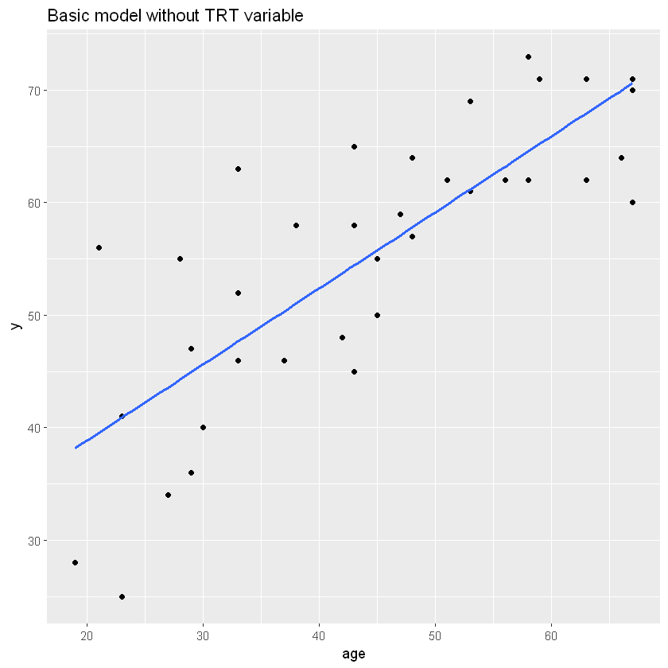
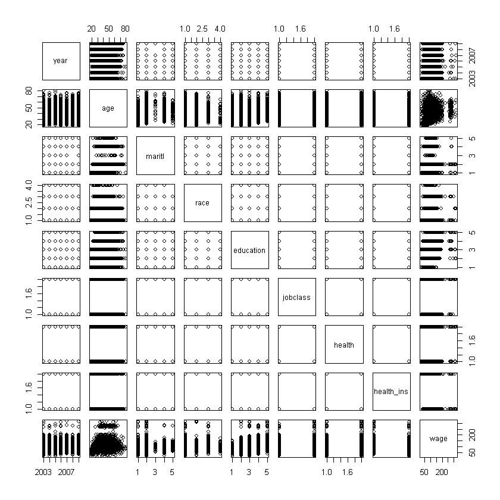
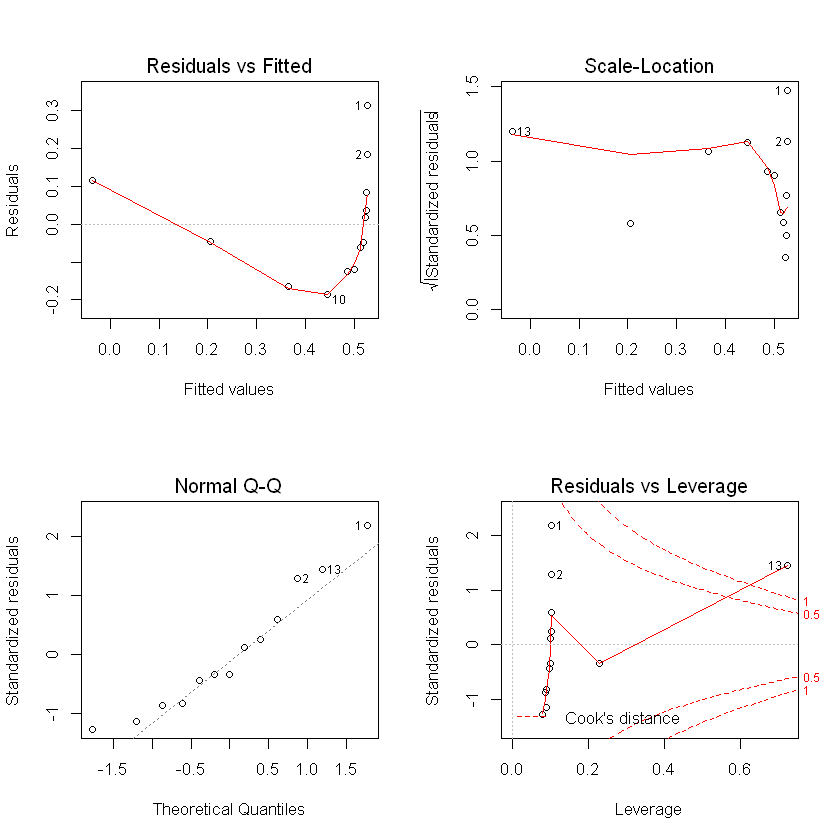

```R
################ Erste Aufgabe #########################3
##Packages we need 
library(corrplot)
library(olsrr)
library(MASS)
install.packages('lmridge',repos = "http://cran.us.r-project.org")
library(lmridge)
install.packages('robustHD',repos = "http://cran.us.r-project.org")
library(robustHD)
library(ggplot2)
install.packages('fastDummies',repos = "http://cran.us.r-project.org")
library(fastDummies)
library(car)
library(rpart)
library(xlsx)
library(bestglm)
library(robustbase)
install.packages('robust',repos = "http://cran.us.r-project.org")
library(robust)
install.packages('rlm',repos = "http://cran.us.r-project.org")
library(rlm)
library(lmtest)
library(glmnet)
install.packages('regclass',repos = "http://cran.us.r-project.org")
install.packages('EnvStats',repos = "http://cran.us.r-project.org")
install.packages('geoR',repos = "http://cran.us.r-project.org")
library(geoR)
library(regclass)
library(EnvStats)
library(leaps)
```

    Installing package into 'C:/Users/User/Documents/R/win-library/3.4'
    (as 'lib' is unspecified)
    

    package 'lmridge' successfully unpacked and MD5 sums checked
    
    The downloaded binary packages are in
    	C:\Users\User\AppData\Local\Temp\Rtmp8kLhPk\downloaded_packages
    

    Installing package into 'C:/Users/User/Documents/R/win-library/3.4'
    (as 'lib' is unspecified)
    

    package 'robustHD' successfully unpacked and MD5 sums checked
    
    The downloaded binary packages are in
    	C:\Users\User\AppData\Local\Temp\Rtmp8kLhPk\downloaded_packages
    

    Loading required package: ggplot2
    Loading required package: perry
    Loading required package: parallel
    Loading required package: robustbase
    Installing package into 'C:/Users/User/Documents/R/win-library/3.4'
    (as 'lib' is unspecified)
    

    package 'fastDummies' successfully unpacked and MD5 sums checked
    
    The downloaded binary packages are in
    	C:\Users\User\AppData\Local\Temp\Rtmp8kLhPk\downloaded_packages
    

    Loading required package: carData
    
    Attaching package: 'car'
    
    The following object is masked from 'package:lmridge':
    
        vif
    
    Loading required package: leaps
    Installing package into 'C:/Users/User/Documents/R/win-library/3.4'
    (as 'lib' is unspecified)
    

    package 'robust' successfully unpacked and MD5 sums checked
    
    The downloaded binary packages are in
    	C:\Users\User\AppData\Local\Temp\Rtmp8kLhPk\downloaded_packages
    

    Loading required package: fit.models
    Installing package into 'C:/Users/User/Documents/R/win-library/3.4'
    (as 'lib' is unspecified)
    

    package 'rlm' successfully unpacked and MD5 sums checked
    
    The downloaded binary packages are in
    	C:\Users\User\AppData\Local\Temp\Rtmp8kLhPk\downloaded_packages
    

    
    Attaching package: 'rlm'
    
    The following object is masked from 'package:MASS':
    
        rlm
    
    Loading required package: zoo
    
    Attaching package: 'zoo'
    
    The following objects are masked from 'package:base':
    
        as.Date, as.Date.numeric
    
    Loading required package: Matrix
    Loading required package: foreach
    Loaded glmnet 2.0-16
    
    Installing package into 'C:/Users/User/Documents/R/win-library/3.4'
    (as 'lib' is unspecified)
    

    package 'regclass' successfully unpacked and MD5 sums checked
    
    The downloaded binary packages are in
    	C:\Users\User\AppData\Local\Temp\Rtmp8kLhPk\downloaded_packages
    

    Installing package into 'C:/Users/User/Documents/R/win-library/3.4'
    (as 'lib' is unspecified)
    

    package 'EnvStats' successfully unpacked and MD5 sums checked
    
    The downloaded binary packages are in
    	C:\Users\User\AppData\Local\Temp\Rtmp8kLhPk\downloaded_packages
    

    Installing package into 'C:/Users/User/Documents/R/win-library/3.4'
    (as 'lib' is unspecified)
    

    package 'geoR' successfully unpacked and MD5 sums checked
    
    The downloaded binary packages are in
    	C:\Users\User\AppData\Local\Temp\Rtmp8kLhPk\downloaded_packages
    

    --------------------------------------------------------------
     Analysis of Geostatistical Data
     For an Introduction to geoR go to http://www.leg.ufpr.br/geoR
     geoR version 1.7-5.2.1 (built on 2016-05-02) is now loaded
    --------------------------------------------------------------
    
    Loading required package: VGAM
    Loading required package: stats4
    Loading required package: splines
    
    Attaching package: 'VGAM'
    
    The following object is masked from 'package:lmtest':
    
        lrtest
    
    The following object is masked from 'package:car':
    
        logit
    
    Loading required package: randomForest
    randomForest 4.6-14
    Type rfNews() to see new features/changes/bug fixes.
    
    Attaching package: 'randomForest'
    
    The following object is masked from 'package:ggplot2':
    
        margin
    
    Important regclass change from 1.3:
    All functions that had a . in the name now have an _
    all.correlations -> all_correlations, cor.demo -> cor_demo, etc.
    
    
    Attaching package: 'EnvStats'
    
    The following objects are masked from 'package:VGAM':
    
        calibrate, dpareto, ppareto, predict, qpareto, rpareto
    
    The following object is masked from 'package:Matrix':
    
        print
    
    The following object is masked from 'package:car':
    
        qqPlot
    
    The following object is masked from 'package:MASS':
    
        boxcox
    
    The following objects are masked from 'package:stats':
    
        predict, predict.lm
    
    The following object is masked from 'package:base':
    
        print.default
    
    


```R
setwd("C:/Users/User/Documents/Data for R/Going through Timw Series/Projects in time series/from Nastia")
ant_d = read.csv("Anti-Depressiva.csv", header=TRUE, sep= ";")
head(ant_d)
```


<table>
<thead><tr><th scope=col>y</th><th scope=col>age</th><th scope=col>TRT</th></tr></thead>
<tbody>
	<tr><td>56</td><td>21</td><td>A </td></tr>
	<tr><td>41</td><td>23</td><td>B </td></tr>
	<tr><td>40</td><td>30</td><td>B </td></tr>
	<tr><td>28</td><td>19</td><td>C </td></tr>
	<tr><td>55</td><td>28</td><td>A </td></tr>
	<tr><td>25</td><td>23</td><td>C </td></tr>
</tbody>
</table>


                               At first let's examine the data.


```R
head(ant_d)
summary(ant_d)
str(ant_d)
```


<table>
<thead><tr><th scope=col>y</th><th scope=col>age</th><th scope=col>TRT</th></tr></thead>
<tbody>
	<tr><td>56</td><td>21</td><td>A </td></tr>
	<tr><td>41</td><td>23</td><td>B </td></tr>
	<tr><td>40</td><td>30</td><td>B </td></tr>
	<tr><td>28</td><td>19</td><td>C </td></tr>
	<tr><td>55</td><td>28</td><td>A </td></tr>
	<tr><td>25</td><td>23</td><td>C </td></tr>
</tbody>
</table>


           y              age        TRT   
     Min.   :25.00   Min.   :19.00   A:12  
     1st Qu.:46.75   1st Qu.:32.25   B:12  
     Median :58.00   Median :44.00   C:12  
     Mean   :55.17   Mean   :44.11         
     3rd Qu.:63.25   3rd Qu.:56.50         
     Max.   :73.00   Max.   :67.00         


    'data.frame':	36 obs. of  3 variables:
     $ y  : int  56 41 40 28 55 25 46 71 48 63 ...
     $ age: int  21 23 30 19 28 23 33 67 42 33 ...
     $ TRT: Factor w/ 3 levels "A","B","C": 1 2 2 3 1 3 2 3 2 1 ...
    

Now we can conclude that we have two numeric variables and one categorical.
it would be very useful to check linear dependence between variables.


```R
plot(ant_d)

```


From this plot we see that y and age have some good linear relationship.


Now we want to check the treatment success at different ages in every type of treatment:


```R
ggplot(ant_d, aes(x=age, y=y))+geom_point()+ facet_wrap(~TRT)
```


Sofar what we see that in '20-30' age group Treatment A has the best success in compare with other Treatments.
And the worst success is in Treatment C for this age group. In other Age groups Treatment A has the best sucsess
as well. But for age group '40-70' Treatment C is better than Treatment B, so it means that for this age group Treatment B is the worst.

And what we can say as well that the relationship between 'y' and 'age' ist linear for every Treatment.

                                 Now we are ready to build models.

Here we use Contrast Treatment Strategy:


```R
m1 = lm(y~ age + TRT, data = ant_d)
summary(m1)
```


    
    Call:
    lm(formula = y ~ age + TRT, data = ant_d)
    
    Residuals:
         Min       1Q   Median       3Q      Max 
    -12.5732  -3.3922   0.9829   3.9613   9.5062 
    
    Coefficients:
                 Estimate Std. Error t value Pr(>|t|)    
    (Intercept)  32.54335    3.58105   9.088 2.23e-10 ***
    age           0.66446    0.06978   9.522 7.42e-11 ***
    TRTB         -9.80758    2.46471  -3.979 0.000371 ***
    TRTC        -10.25276    2.46542  -4.159 0.000224 ***
    ---
    Signif. codes:  0 '***' 0.001 '**' 0.01 '*' 0.05 '.' 0.1 ' ' 1
    
    Residual standard error: 6.035 on 32 degrees of freedom
    Multiple R-squared:  0.784,	Adjusted R-squared:  0.7637 
    F-statistic: 38.71 on 3 and 32 DF,  p-value: 9.287e-11
    


 All our variables are statistically significant
 R_adj is 76.37%, what is quite good.
 For the group A the model would be the baseline.
 For the group B we will get the model with the baseline smaller on 9.80758
 And for the group C we will get the model with the baseline smaller on 10.25276.


Now we use contrast sum strategy


```R
options(contrasts=c("contr.sum", "contr.poly"))
contrasts(ant_d[,3])
summary(lm(y~age+TRT, data = ant_d))
```


<table>
<tbody>
	<tr><th scope=row>A</th><td> 1</td><td> 0</td></tr>
	<tr><th scope=row>B</th><td> 0</td><td> 1</td></tr>
	<tr><th scope=row>C</th><td>-1</td><td>-1</td></tr>
</tbody>
</table>


    
    Call:
    lm(formula = y ~ age + TRT, data = ant_d)
    
    Residuals:
         Min       1Q   Median       3Q      Max 
    -12.5732  -3.3922   0.9829   3.9613   9.5062 
    
    Coefficients:
                Estimate Std. Error t value Pr(>|t|)    
    (Intercept) 25.85657    3.23845   7.984 4.10e-09 ***
    age          0.66446    0.06978   9.522 7.42e-11 ***
    TRT1         6.68678    1.42341   4.698 4.77e-05 ***
    TRT2        -3.12080    1.42259  -2.194   0.0356 *  
    ---
    Signif. codes:  0 '***' 0.001 '**' 0.01 '*' 0.05 '.' 0.1 ' ' 1
    
    Residual standard error: 6.035 on 32 degrees of freedom
    Multiple R-squared:  0.784,	Adjusted R-squared:  0.7637 
    F-statistic: 38.71 on 3 and 32 DF,  p-value: 9.287e-11
    


Interpretation of the sum contrast:


 Intercept is the overall mean across all groups.
 It means that overall measurement sucess is 25.85657. 
 The second coefficient is the average slope between overall mean and age. 
 If we increase age by one unit then our overall mesurement sucess will increase on 0.66446 across all groups.
 The coefficient TRT1 is the difference between overall mean and group 1.
 Measurement sucess for group 1 would be higher on 6.68678 than our overall measurement sucess.
 And TRT2 coefficient is the difference between overall mean and group 2.
 Measurement sucess for group 2 would be smaller on -3.12080 than our averall measurement sucess.


Which conclusions do you reach regarding the predictor “TRT”, which indicates three different treatments?


```R
summary(lm(y~age, data = ant_d)) #Here our Adjusted R2 is 0.624.
summary(lm(y~age + TRT, data = ant_d)) #Here our Adjusted R2 is 0.7637.

```


    
    Call:
    lm(formula = y ~ age, data = ant_d)
    
    Residuals:
         Min       1Q   Median       3Q      Max 
    -15.8916  -5.7463  -0.4105   4.7013  16.4607 
    
    Coefficients:
                Estimate Std. Error t value Pr(>|t|)    
    (Intercept) 25.33935    4.08258   6.207 4.65e-07 ***
    age          0.67619    0.08797   7.687 6.15e-09 ***
    ---
    Signif. codes:  0 '***' 0.001 '**' 0.01 '*' 0.05 '.' 0.1 ' ' 1
    
    Residual standard error: 7.613 on 34 degrees of freedom
    Multiple R-squared:  0.6347,	Adjusted R-squared:  0.624 
    F-statistic: 59.08 on 1 and 34 DF,  p-value: 6.155e-09
    


    
    Call:
    lm(formula = y ~ age + TRT, data = ant_d)
    
    Residuals:
         Min       1Q   Median       3Q      Max 
    -12.5732  -3.3922   0.9829   3.9613   9.5062 
    
    Coefficients:
                Estimate Std. Error t value Pr(>|t|)    
    (Intercept) 25.85657    3.23845   7.984 4.10e-09 ***
    age          0.66446    0.06978   9.522 7.42e-11 ***
    TRT1         6.68678    1.42341   4.698 4.77e-05 ***
    TRT2        -3.12080    1.42259  -2.194   0.0356 *  
    ---
    Signif. codes:  0 '***' 0.001 '**' 0.01 '*' 0.05 '.' 0.1 ' ' 1
    
    Residual standard error: 6.035 on 32 degrees of freedom
    Multiple R-squared:  0.784,	Adjusted R-squared:  0.7637 
    F-statistic: 38.71 on 3 and 32 DF,  p-value: 9.287e-11
    


We showed that a predictor TRT does improve our Adjusted R^(2),
it means increased explanation of the variation. So therefore we have to include this predictor in our model.


 Compare and interpret models with and without interaction terms!


```R
einf_mod = lm(y~age+TRT, data = ant_d)
mod_int =  lm(y~age*TRT, data = ant_d)
summary(einf_mod)
summary(mod_int)
```


    
    Call:
    lm(formula = y ~ age + TRT, data = ant_d)
    
    Residuals:
         Min       1Q   Median       3Q      Max 
    -12.5732  -3.3922   0.9829   3.9613   9.5062 
    
    Coefficients:
                Estimate Std. Error t value Pr(>|t|)    
    (Intercept) 25.85657    3.23845   7.984 4.10e-09 ***
    age          0.66446    0.06978   9.522 7.42e-11 ***
    TRT1         6.68678    1.42341   4.698 4.77e-05 ***
    TRT2        -3.12080    1.42259  -2.194   0.0356 *  
    ---
    Signif. codes:  0 '***' 0.001 '**' 0.01 '*' 0.05 '.' 0.1 ' ' 1
    
    Residual standard error: 6.035 on 32 degrees of freedom
    Multiple R-squared:  0.784,	Adjusted R-squared:  0.7637 
    F-statistic: 38.71 on 3 and 32 DF,  p-value: 9.287e-11
    


    
    Call:
    lm(formula = y ~ age * TRT, data = ant_d)
    
    Residuals:
        Min      1Q  Median      3Q     Max 
    -6.4366 -2.7637  0.1887  2.9075  6.5634 
    
    Coefficients:
                Estimate Std. Error t value Pr(>|t|)    
    (Intercept) 27.54839    2.12264  12.978 7.68e-14 ***
    age          0.62919    0.04574  13.757 1.71e-14 ***
    TRT1        19.96720    3.06317   6.518 3.31e-07 ***
    TRT2         1.36981    3.06673   0.447    0.658    
    age:TRT1    -0.29869    0.06562  -4.552 8.23e-05 ***
    age:TRT2    -0.10551    0.06641  -1.589    0.123    
    ---
    Signif. codes:  0 '***' 0.001 '**' 0.01 '*' 0.05 '.' 0.1 ' ' 1
    
    Residual standard error: 3.925 on 30 degrees of freedom
    Multiple R-squared:  0.9143,	Adjusted R-squared:  0.9001 
    F-statistic: 64.04 on 5 and 30 DF,  p-value: 4.264e-15
    


We see from the results that we gain some information because of interaction terms, therefore our adj. R2 is beter now.


This is our model with interaction effects:

Age: if we increase one unit of age our sucess will increase on 0.33051 for all groups.

TRTB: Our Sucess for Group B Would be smaller on -18.59739 than in group A.

TRTC: Our Sucess for Group C would be smaller on -14.30421 than in group A.

age:TRTB: If we increase one unit of age our sucess for group B would be higher on 0.19318.It means that difference betwenn group A and B increases on 0.19318.

age:TRTC: If we increase one unit of age our sucess for group C would be higher on 0.70288. It means that difference betwenn group A and C increases on 0.70288.

All our coefficients are siginificant except of age:TRT2 and TRT2.


```R
anova(einf_mod,mod_int)
```


<table>
<thead><tr><th scope=col>Res.Df</th><th scope=col>RSS</th><th scope=col>Df</th><th scope=col>Sum of Sq</th><th scope=col>F</th><th scope=col>Pr(&gt;F)</th></tr></thead>
<tbody>
	<tr><td>32          </td><td>1165.5747   </td><td>NA          </td><td>     NA     </td><td>      NA    </td><td>          NA</td></tr>
	<tr><td>30          </td><td> 462.1477   </td><td> 2          </td><td>703.427     </td><td>22.83124    </td><td>9.410457e-07</td></tr>
</tbody>
</table>


As we can see that the model with group-speciffic effects gives a better fit than the model
without group-specific effects (p < 0.05).


```R
 ######  Visualize the data and the different models estimated  ##########
ggplot(data = ant_d, aes(age, y, colour = TRT)) +
      geom_point() +
      geom_smooth(se = FALSE, method = lm) + ggtitle("Model, with TRT variable, for every group")

```


```R
ggplot(data = ant_d, aes(age, y)) +
      geom_point() +
      geom_smooth(se = FALSE, method = lm) + ggtitle("Basic model without TRT variable")
 
```





                                     Task 2


```R
install.packages('ISLR',repos = "http://cran.us.r-project.org")
library(ISLR)
```

    Installing package into 'C:/Users/User/Documents/R/win-library/3.4'
    (as 'lib' is unspecified)
    

    package 'ISLR' successfully unpacked and MD5 sums checked
    
    The downloaded binary packages are in
    	C:\Users\User\AppData\Local\Temp\Rtmp8kLhPk\downloaded_packages
    


```R
Wage_c <- Wage[colnames(Wage)[!(colnames(Wage) %in% c("logwage", "region"))]]
set.seed(100) 
train_ind <- sample(1:nrow(Wage_c), round(0.7*nrow(Wage_c)))
Wage_train <- Wage_c[train_ind,]
Wage_test <- Wage_c[-train_ind,]
```


```R
summary(Wage_c) 
```


          year           age                     maritl           race     
     Min.   :2003   Min.   :18.00   1. Never Married: 648   1. White:2480  
     1st Qu.:2004   1st Qu.:33.75   2. Married      :2074   2. Black: 293  
     Median :2006   Median :42.00   3. Widowed      :  19   3. Asian: 190  
     Mean   :2006   Mean   :42.41   4. Divorced     : 204   4. Other:  37  
     3rd Qu.:2008   3rd Qu.:51.00   5. Separated    :  55                  
     Max.   :2009   Max.   :80.00                                          
                  education             jobclass               health    
     1. < HS Grad      :268   1. Industrial :1544   1. <=Good     : 858  
     2. HS Grad        :971   2. Information:1456   2. >=Very Good:2142  
     3. Some College   :650                                              
     4. College Grad   :685                                              
     5. Advanced Degree:426                                              
                                                                         
      health_ins        wage       
     1. Yes:2083   Min.   : 20.09  
     2. No : 917   1st Qu.: 85.38  
                   Median :104.92  
                   Mean   :111.70  
                   3rd Qu.:128.68  
                   Max.   :318.34  


```R
str(Wage_c)
```

    'data.frame':	3000 obs. of  9 variables:
     $ year      : int  2006 2004 2003 2003 2005 2008 2009 2008 2006 2004 ...
     $ age       : int  18 24 45 43 50 54 44 30 41 52 ...
     $ maritl    : Factor w/ 5 levels "1. Never Married",..: 1 1 2 2 4 2 2 1 1 2 ...
     $ race      : Factor w/ 4 levels "1. White","2. Black",..: 1 1 1 3 1 1 4 3 2 1 ...
     $ education : Factor w/ 5 levels "1. < HS Grad",..: 1 4 3 4 2 4 3 3 3 2 ...
     $ jobclass  : Factor w/ 2 levels "1. Industrial",..: 1 2 1 2 2 2 1 2 2 2 ...
     $ health    : Factor w/ 2 levels "1. <=Good","2. >=Very Good": 1 2 1 2 1 2 2 1 2 2 ...
     $ health_ins: Factor w/ 2 levels "1. Yes","2. No": 2 2 1 1 1 1 1 1 1 1 ...
     $ wage      : num  75 70.5 131 154.7 75 ...
    

We have three numerical variables and other are categorical variables.


```R
plot(Wage_c)
```





As we can conclude from the Graph that there is no much linear relation between variables.
There is some linear relation between age and wage.


Lets make simple model at first:


```R
mod_1 = lm(wage~., data = Wage_train)
summary(mod_1)
```


    
    Call:
    lm(formula = wage ~ ., data = Wage_train)
    
    Residuals:
       Min     1Q Median     3Q    Max 
    -96.12 -18.53  -3.30  12.98 212.21 
    
    Coefficients:
                  Estimate Std. Error t value Pr(>|t|)    
    (Intercept) -2.397e+03  7.327e+02  -3.271  0.00109 ** 
    year         1.236e+00  3.653e-01   3.383  0.00073 ***
    age          3.683e-01  7.285e-02   5.056 4.66e-07 ***
    maritl1     -6.581e+00  2.644e+00  -2.489  0.01290 *  
    maritl2      1.082e+01  2.322e+00   4.657 3.41e-06 ***
    maritl3     -6.211e+00  7.307e+00  -0.850  0.39538    
    maritl4     -1.457e+00  3.105e+00  -0.469  0.63893    
    race1        4.920e+00  2.027e+00   2.427  0.01529 *  
    race2       -2.536e+00  2.598e+00  -0.976  0.32916    
    race3        2.359e+00  2.898e+00   0.814  0.41580    
    education1  -2.256e+01  2.109e+00 -10.699  < 2e-16 ***
    education2  -1.498e+01  1.324e+00 -11.314  < 2e-16 ***
    education3  -4.006e+00  1.489e+00  -2.691  0.00717 ** 
    education4   1.037e+01  1.446e+00   7.175 9.99e-13 ***
    jobclass1   -1.592e+00  7.814e-01  -2.037  0.04178 *  
    health1     -4.452e+00  8.444e-01  -5.272 1.49e-07 ***
    health_ins1  7.896e+00  8.195e-01   9.636  < 2e-16 ***
    ---
    Signif. codes:  0 '***' 0.001 '**' 0.01 '*' 0.05 '.' 0.1 ' ' 1
    
    Residual standard error: 33.52 on 2083 degrees of freedom
    Multiple R-squared:  0.359,	Adjusted R-squared:  0.3541 
    F-statistic: 72.91 on 16 and 2083 DF,  p-value: < 2.2e-16
    


We got adjusted R2 of 0.3361. It makes sense to compare adj.R2  because R2 is increasing by adding new variables.


```R
y_hat_mod1 = predict(mod_1, Wage_test)
mean((Wage_test$wage-y_hat_mod1)^(2)) 
```


1244.23861249978


This is our RSS for the first model

Model Diagnostic Plots:


```R
layout(matrix(c(1,2,3,4),2,2)) 
plot(mod_1) 
```


 As we see that there is no non-linearities. But we detected some signs of heteroscedasticity
 because the line in the second graph has some curvature.And we see that we have some non-normal residuals
 lets examine, whether we have the heteroscedasticity.
 
We use method of studentized Breusch-Pagan test:


```R
bptest(mod_1) 
```


    
    Results of Hypothesis Test
    --------------------------
    
    Alternative Hypothesis:          
    
    Test Name:                       studentized Breusch-Pagan test
    
    Data:                            mod_1
    
    Test Statistic:                  BP = 98.58497
    
    Test Statistic Parameter:        df = 16
    
    P-value:                         6.375109e-14
    


 The null hypothesis of homoskedasticity is rejected and heteroskedasticity assumed.
 Now we will try different techniques to eliminate heteroscedasticity.


 The first is Box-Cox Transformation:


```R
boxcox(mod_1) 
```


    
    Results of Box-Cox Transformation
    ---------------------------------
    
    Objective Name:                  PPCC
    
    Linear Model:                    mod_1
    
    Sample Size:                     2100
    
     lambda      PPCC
       -2.0 0.6741324
       -1.5 0.7776405
       -1.0 0.8756979
       -0.5 0.9482455
        0.0 0.9811074
        0.5 0.9727599
        1.0 0.9344070
        1.5 0.8804740
        2.0 0.8224301


 From this results we see that we have to transform our Y with log function.
 

 Lets show it with some graph:


```R
plot(x = boxcox(mod_1)$lambda,y = boxcox(mod_1)$objective, xlab = 'lambda', ylab = 'PPCC', type = 'l')
abline(h=max(boxcox(mod_1)$objective), col = 'red')
```


We take lambda with maximum value of PPCC, which we found with Likelihood Estimation. In our case its 0.
it means that we will transform our Y(wage) with log function.


```R
mod_2 = lm(log(wage) ~., data  = Wage_train)
summary(mod_2)
```


    
    Call:
    lm(formula = log(wage) ~ ., data = Wage_train)
    
    Residuals:
        Min      1Q  Median      3Q     Max 
    -1.5099 -0.1466  0.0027  0.1516  1.2353 
    
    Coefficients:
                  Estimate Std. Error t value Pr(>|t|)    
    (Intercept) -2.235e+01  5.995e+00  -3.728 0.000198 ***
    year         1.333e-02  2.989e-03   4.459 8.67e-06 ***
    age          3.354e-03  5.961e-04   5.627 2.09e-08 ***
    maritl1     -7.298e-02  2.164e-02  -3.373 0.000757 ***
    maritl2      8.907e-02  1.900e-02   4.687 2.95e-06 ***
    maritl3     -3.907e-02  5.979e-02  -0.654 0.513476    
    maritl4     -2.194e-02  2.541e-02  -0.864 0.387901    
    race1        4.232e-02  1.658e-02   2.552 0.010780 *  
    race2       -1.125e-02  2.126e-02  -0.529 0.596799    
    race3        2.626e-02  2.371e-02   1.107 0.268251    
    education1  -1.989e-01  1.725e-02 -11.530  < 2e-16 ***
    education2  -1.212e-01  1.083e-02 -11.184  < 2e-16 ***
    education3  -1.741e-02  1.218e-02  -1.429 0.153055    
    education4   9.935e-02  1.183e-02   8.397  < 2e-16 ***
    jobclass1   -1.122e-02  6.394e-03  -1.754 0.079554 .  
    health1     -4.235e-02  6.910e-03  -6.128 1.06e-09 ***
    health_ins1  9.021e-02  6.705e-03  13.453  < 2e-16 ***
    ---
    Signif. codes:  0 '***' 0.001 '**' 0.01 '*' 0.05 '.' 0.1 ' ' 1
    
    Residual standard error: 0.2743 on 2083 degrees of freedom
    Multiple R-squared:  0.4004,	Adjusted R-squared:  0.3958 
    F-statistic: 86.95 on 16 and 2083 DF,  p-value: < 2.2e-16
    


What we see so far that our adj.R2 is better than in model 1 before transformation.


```R
y_hat_mod2 = predict(mod_2, Wage_test)
mean((Wage_test$wage-exp(y_hat_mod2))^(2))
```


1238.94614159883


This is our RSS for the second model.


```R
layout(matrix(c(1,2,3,4),2,2))
plot(mod_2) 
```


As we see from the graph, we eliminated heteroscedasticity because in 'Scale location' we don't have any curvatures.And now our residuals are more normal.


Now we want to try another approach against heteroscedasticity- Robust Regression. But it would be useful against non-normal errors as well.


```R
mod_3 = lmrob(wage~., data = Wage_train) 
summary(mod_3)
```


    
    Call:
    lmrob(formula = wage ~ ., data = Wage_train)
     \--> method = "MM"
    Residuals:
         Min       1Q   Median       3Q      Max 
    -82.3732 -14.6653   0.4727  16.7189 213.9589 
    
    Coefficients:
                  Estimate Std. Error t value Pr(>|t|)    
    (Intercept) -2667.5255   540.5999  -4.934 8.68e-07 ***
    year            1.3726     0.2695   5.094 3.83e-07 ***
    age             0.2662     0.0543   4.903 1.02e-06 ***
    maritl1        -7.2604     1.7271  -4.204 2.74e-05 ***
    maritl2         8.2027     1.5690   5.228 1.88e-07 ***
    maritl3        -3.1027     5.0939  -0.609   0.5425    
    maritl4        -1.1782     2.0806  -0.566   0.5713    
    race1           3.1986     1.5027   2.129   0.0334 *  
    race2          -2.2262     1.7797  -1.251   0.2111    
    race3           2.7254     2.2875   1.191   0.2336    
    education1    -19.3336     1.2574 -15.376  < 2e-16 ***
    education2    -12.3684     0.8940 -13.834  < 2e-16 ***
    education3     -1.5123     1.0225  -1.479   0.1393    
    education4     10.3313     1.1833   8.731  < 2e-16 ***
    jobclass1      -0.6465     0.5612  -1.152   0.2495    
    health1        -2.9880     0.5860  -5.099 3.73e-07 ***
    health_ins1     7.7833     0.6036  12.896  < 2e-16 ***
    ---
    Signif. codes:  0 '***' 0.001 '**' 0.01 '*' 0.05 '.' 0.1 ' ' 1
    
    Robust residual standard error: 22.85 
    Multiple R-squared:  0.4337,	Adjusted R-squared:  0.4294 
    Convergence in 10 IRWLS iterations
    
    Robustness weights: 
     56 observations c(9,78,103,129,136,139,147,177,187,219,226,251,289,370,410,421,425,601,603,653,657,717,782,874,934,935,943,978,1000,1005,1078,1136,1156,1162,1258,1275,1329,1414,1433,1479,1485,1495,1505,1516,1588,1605,1619,1637,1706,1779,1917,1946,2009,2028,2082,2094)
    	 are outliers with |weight| = 0 ( < 4.8e-05); 
     163 weights are ~= 1. The remaining 1881 ones are summarized as
       Min. 1st Qu.  Median    Mean 3rd Qu.    Max. 
    0.01678 0.87020 0.95310 0.89730 0.98720 0.99900 
    Algorithmic parameters: 
           tuning.chi                bb        tuning.psi        refine.tol 
            1.548e+00         5.000e-01         4.685e+00         1.000e-07 
              rel.tol         solve.tol       eps.outlier             eps.x 
            1.000e-07         1.000e-07         4.762e-05         3.654e-09 
    warn.limit.reject warn.limit.meanrw 
            5.000e-01         5.000e-01 
         nResample         max.it       best.r.s       k.fast.s          k.max 
               500             50              2              1            200 
       maxit.scale      trace.lev            mts     compute.rd fast.s.large.n 
               200              0           1000              0           2000 
                      psi           subsampling                   cov 
               "bisquare"         "nonsingular"         ".vcov.avar1" 
    compute.outlier.stats 
                     "SM" 
    seed : int(0) 


By default we use here MM estimation.
As we see, our ADJ.R2 is better and residual standard errors is lower.


```R
y_hat_mod3 = predict(mod_3, Wage_test)
mean((Wage_test$wage-y_hat_mod3)^(2)) 
```


1263.85973522467


This is our RSS for the third model.


```R
layout(matrix(c(1,2,3,4),2,2))
plot(mod_3) 
```

    recomputing robust Mahalanobis distances
    Warning message in robMD(x = if (!is.null(x[["x"]])) x$x else if (!is.null(x[["model"]])) model.matrix(x, :
    "Failed to compute robust Mahalanobis distances, reverting to robust leverages."saving the robust distances 'MD' as part of 'mod_3'
    


 As we also see from the graph that in 'Scale-Location' we have smaller curvatures.
 What means that whis model had some positive effect against hetereoscedasticity.
 Before we examine every models RSS we want to check other models.

 First of all we want check, whether we have a multicollinearity or not.
 We do it with vif function:


```R
vif(mod_1) 
```


<table>
<thead><tr><th></th><th scope=col>GVIF</th><th scope=col>Df</th><th scope=col>GVIF^(1/(2*Df))</th></tr></thead>
<tbody>
	<tr><th scope=row>year</th><td>1.008268</td><td>1       </td><td>1.004126</td></tr>
	<tr><th scope=row>age</th><td>1.358511</td><td>1       </td><td>1.165552</td></tr>
	<tr><th scope=row>maritl</th><td>1.334812</td><td>4       </td><td>1.036758</td></tr>
	<tr><th scope=row>race</th><td>1.102919</td><td>3       </td><td>1.016461</td></tr>
	<tr><th scope=row>education</th><td>1.286740</td><td>4       </td><td>1.032016</td></tr>
	<tr><th scope=row>jobclass</th><td>1.138379</td><td>1       </td><td>1.066948</td></tr>
	<tr><th scope=row>health</th><td>1.085707</td><td>1       </td><td>1.041973</td></tr>
	<tr><th scope=row>health_ins</th><td>1.078308</td><td>1       </td><td>1.038416</td></tr>
</tbody>
</table>


 As we can conclude that we don't have any multicollinearity beacause our vif is small enough (under 4).

 Now we want to use Ridge Regression.
 
 For this model we will need 'cv.glmnet' function from glmnet package.
 With these model we will find optimal lambda for our prediction.


 At First we construct dummy matrix with predictor variables in order to be able to use it in 'cv.glmnet' function.


```R
dummy_pred = model.matrix(mod_1) 
mod_4 = cv.glmnet(y=Wage_train[['wage']], x = dummy_pred, alpha=0)
```


```R
plot(mod_4) 
```


Here we see the graph of MSE and lambda. We need lambda with minimal MSE.


```R
opt_lambda = mod_4$lambda.min 
opt_lambda
```


1.86573427510234


Our optimal Lambda.


```R
fit = mod_4$glmnet.fit
summary(fit) 
```


              Length Class     Mode   
    a0         100   -none-    numeric
    beta      1700   dgCMatrix S4     
    df         100   -none-    numeric
    dim          2   -none-    numeric
    lambda     100   -none-    numeric
    dev.ratio  100   -none-    numeric
    nulldev      1   -none-    numeric
    npasses      1   -none-    numeric
    jerr         1   -none-    numeric
    offset       1   -none-    logical
    call         4   -none-    call   
    nobs         1   -none-    numeric


Our model that we need for the prediction.


```R
x_test = model.matrix(~Wage_test[['year']]+Wage_test[['age']]+Wage_test[['maritl']]+Wage_test[['race']]+Wage_test[['education']]
                      +Wage_test[['jobclass']]+Wage_test[['health']]+Wage_test[['health_ins']]) # with this command we construct testing X dummy matrix. 
y_hat_mod4 = predict(fit, newx = x_test, s = opt_lambda)
mean((Wage_test$wage-y_hat_mod4)^(2)) 
```


1240.59832910542


 This is our RSS for the fourth model


Our fifth model will be build with LASSO:


```R
mod_5 = cv.glmnet(y=Wage_train[['wage']], x = dummy_pred, alpha=1)
plot(mod_5)
```


Here we see the graph of MSE and lambda. We need lambda with minimal MSE.


```R
opt_lambda_lasso = mod_5$lambda.min
opt_lambda_lasso
```


0.0531367813646155


 Our optimal Lambda.


```R
fit_lasso = mod_5$glmnet.fit
summary(fit_lasso)
y_hat_mod5 = predict(fit_lasso, newx = x_test, s = opt_lambda_lasso)
mean((Wage_test$wage-y_hat_mod5)^(2)) 
```


              Length Class     Mode   
    a0          64   -none-    numeric
    beta      1088   dgCMatrix S4     
    df          64   -none-    numeric
    dim          2   -none-    numeric
    lambda      64   -none-    numeric
    dev.ratio   64   -none-    numeric
    nulldev      1   -none-    numeric
    npasses      1   -none-    numeric
    jerr         1   -none-    numeric
    offset       1   -none-    logical
    call         4   -none-    call   
    nobs         1   -none-    numeric


1242.86991305753


This is our RSS for the fifth model.


Now we want to build model using regression-tree.


 We building regression-tree model with rpart function from rpart library.


```R
mod_6 = rpart(wage~., method="anova", data=Wage_train) 
printcp(mod_6)
```

    
    Regression tree:
    rpart(formula = wage ~ ., data = Wage_train, method = "anova")
    
    Variables actually used in tree construction:
    [1] age        education  health_ins maritl    
    
    Root node error: 3651382/2100 = 1738.8
    
    n= 2100 
    
            CP nsplit rel error  xerror     xstd
    1 0.193812      0   1.00000 1.00174 0.056389
    2 0.033704      1   0.80619 0.80882 0.047834
    3 0.030678      2   0.77248 0.79446 0.046447
    4 0.025205      3   0.74181 0.75946 0.046515
    5 0.011966      4   0.71660 0.73499 0.045262
    6 0.011389      5   0.70464 0.72279 0.044405
    7 0.010548      6   0.69325 0.71855 0.044094
    8 0.010000      7   0.68270 0.70816 0.043585
    

Here we choose complexity parameter with the smallest xerror.


```R
plotcp(mod_6)
```


We can see from the graph changing of xerror by changing of cp(complexity parameter).


```R
mod_6_opt = prune(mod_6, cp=0.01) 
```

Here we design the tree with the optimal tree size.


```R
y_hat_mod6 = predict(mod_6_opt, Wage_test)
mean((Wage_test$wage-y_hat_mod6)^(2)) 
```


1362.06913946642


This is our RSS for the sixth model.

As we used regression-Tree lets try to use Random Forest to check if we can improve our results with that.


```R
mode_7 = randomForest(wage~ ., Wage_train, ntree=50, norm.votes=FALSE)
y_hat_mod7 = predict(mode_7, Wage_test)
mean((Wage_test$wage-y_hat_mod7)^(2))
```


1243.3829569491


It was quite good result right here.So far the best one. But let's try to increase the number of trees.


```R
mode_8 = randomForest(wage~ ., Wage_train, ntree=100, norm.votes=FALSE)
y_hat_mod8 = predict(mode_8, Wage_test)
mean((Wage_test$wage-y_hat_mod8)^(2)) 
```


1238.95534025832


The result is even better right now.

And the last one.


```R
mode_9 = randomForest(wage~ ., Wage_train, ntree=200, norm.votes=FALSE)
y_hat_mod9 = predict(mode_9, Wage_test)
mean((Wage_test$wage-y_hat_mod9)^(2))
```


1233.39083118327


```R
puf=randomForest(wage~ ., Wage_train)
plot(puf)
```


Here we can see dependency between number of trees and error.


What we can conclude that the smallest average RSS is in the second and in the ninth model. 
Therefore i would choose this models for the prediction.

                                      


                                             Task 3


```R
r_est = read.table("realestate.txt", header=TRUE)

```


```R
head(r_est)
summary(r_est)
str(r_est)
```


<table>
<thead><tr><th scope=col>SalesPrice</th><th scope=col>SqFeet</th><th scope=col>Beds</th><th scope=col>Baths</th><th scope=col>AirCond</th><th scope=col>Garage</th><th scope=col>Pool</th><th scope=col>Year</th><th scope=col>Quality</th><th scope=col>Style</th><th scope=col>Lot</th><th scope=col>Highway</th></tr></thead>
<tbody>
	<tr><td>360.0 </td><td>3.032 </td><td>4     </td><td>4     </td><td>1     </td><td>2     </td><td>0     </td><td>1972  </td><td>2     </td><td>1     </td><td>22.221</td><td>0     </td></tr>
	<tr><td>340.0 </td><td>2.058 </td><td>4     </td><td>2     </td><td>1     </td><td>2     </td><td>0     </td><td>1976  </td><td>2     </td><td>1     </td><td>22.912</td><td>0     </td></tr>
	<tr><td>250.0 </td><td>1.780 </td><td>4     </td><td>3     </td><td>1     </td><td>2     </td><td>0     </td><td>1980  </td><td>2     </td><td>1     </td><td>21.345</td><td>0     </td></tr>
	<tr><td>205.5 </td><td>1.638 </td><td>4     </td><td>2     </td><td>1     </td><td>2     </td><td>0     </td><td>1963  </td><td>2     </td><td>1     </td><td>17.342</td><td>0     </td></tr>
	<tr><td>275.5 </td><td>2.196 </td><td>4     </td><td>3     </td><td>1     </td><td>2     </td><td>0     </td><td>1968  </td><td>2     </td><td>7     </td><td>21.786</td><td>0     </td></tr>
	<tr><td>248.0 </td><td>1.966 </td><td>4     </td><td>3     </td><td>1     </td><td>5     </td><td>1     </td><td>1972  </td><td>2     </td><td>1     </td><td>18.902</td><td>0     </td></tr>
</tbody>
</table>


       SalesPrice        SqFeet           Beds           Baths      
     Min.   : 84.0   Min.   :0.980   Min.   :1.000   Min.   :1.000  
     1st Qu.:180.0   1st Qu.:1.701   1st Qu.:3.000   1st Qu.:2.000  
     Median :229.9   Median :2.061   Median :3.000   Median :3.000  
     Mean   :277.4   Mean   :2.261   Mean   :3.478   Mean   :2.647  
     3rd Qu.:335.0   3rd Qu.:2.638   3rd Qu.:4.000   3rd Qu.:3.000  
     Max.   :920.0   Max.   :5.032   Max.   :7.000   Max.   :7.000  
        AirCond           Garage           Pool             Year     
     Min.   :0.0000   Min.   :0.000   Min.   :0.0000   Min.   :1885  
     1st Qu.:1.0000   1st Qu.:2.000   1st Qu.:0.0000   1st Qu.:1956  
     Median :1.0000   Median :2.000   Median :0.0000   Median :1966  
     Mean   :0.8311   Mean   :2.098   Mean   :0.0691   Mean   :1967  
     3rd Qu.:1.0000   3rd Qu.:2.000   3rd Qu.:0.0000   3rd Qu.:1981  
     Max.   :1.0000   Max.   :7.000   Max.   :1.0000   Max.   :1998  
        Quality          Style             Lot           Highway       
     Min.   :1.000   Min.   : 1.000   Min.   : 4.56   Min.   :0.00000  
     1st Qu.:2.000   1st Qu.: 1.000   1st Qu.:17.16   1st Qu.:0.00000  
     Median :2.000   Median : 2.000   Median :22.20   Median :0.00000  
     Mean   :2.186   Mean   : 3.349   Mean   :24.34   Mean   :0.02111  
     3rd Qu.:3.000   3rd Qu.: 7.000   3rd Qu.:26.78   3rd Qu.:0.00000  
     Max.   :3.000   Max.   :11.000   Max.   :86.83   Max.   :1.00000  


    'data.frame':	521 obs. of  12 variables:
     $ SalesPrice: num  360 340 250 206 276 ...
     $ SqFeet    : num  3.03 2.06 1.78 1.64 2.2 ...
     $ Beds      : int  4 4 4 4 4 4 3 2 3 3 ...
     $ Baths     : int  4 2 3 2 3 3 2 1 2 3 ...
     $ AirCond   : int  1 1 1 1 1 1 1 1 1 0 ...
     $ Garage    : int  2 2 2 2 2 5 2 1 2 1 ...
     $ Pool      : int  0 0 0 0 0 1 0 0 0 0 ...
     $ Year      : int  1972 1976 1980 1963 1968 1972 1972 1955 1975 1918 ...
     $ Quality   : int  2 2 2 2 2 2 2 2 3 3 ...
     $ Style     : int  1 1 1 1 7 1 7 1 1 1 ...
     $ Lot       : num  22.2 22.9 21.3 17.3 21.8 ...
     $ Highway   : int  0 0 0 0 0 0 0 0 0 0 ...
    

We have to make 'Style' categorical.


```R
r_est['Style'] = factor(r_est[['Style']], labels = c(1,  2 , 3 , 4 , 5 , 6 , 7 , 9 ,10 ,11) ) 
```

Let's examine our data.


```R
plot(r_est)
```


As we can see from the graph, "Sales Price' variable has a linear relationship with the most variables.


Now we will use Mallow’s Cp for variable selection.

At first we try a function 'regsubsets' from 'leaps' package.


```R
model_1 = regsubsets(SalesPrice~., data=r_est,nbest = 1, nvmax = NULL,
                   force.in = NULL, force.out = NULL,
                   method = "exhaustive")
```

We use hear the method of exhaustive search, what means that we have to check all possible candidates for the solution.


```R
summary(model_1)
```


    Subset selection object
    Call: regsubsets.formula(SalesPrice ~ ., data = r_est, nbest = 1, nvmax = NULL, 
        force.in = NULL, force.out = NULL, method = "exhaustive")
    19 Variables  (and intercept)
            Forced in Forced out
    SqFeet      FALSE      FALSE
    Beds        FALSE      FALSE
    Baths       FALSE      FALSE
    AirCond     FALSE      FALSE
    Garage      FALSE      FALSE
    Pool        FALSE      FALSE
    Year        FALSE      FALSE
    Quality     FALSE      FALSE
    Style1      FALSE      FALSE
    Style2      FALSE      FALSE
    Style3      FALSE      FALSE
    Style4      FALSE      FALSE
    Style5      FALSE      FALSE
    Style6      FALSE      FALSE
    Style7      FALSE      FALSE
    Style8      FALSE      FALSE
    Style9      FALSE      FALSE
    Lot         FALSE      FALSE
    Highway     FALSE      FALSE
    1 subsets of each size up to 19
    Selection Algorithm: exhaustive
              SqFeet Beds Baths AirCond Garage Pool Year Quality Style1 Style2
    1  ( 1 )  "*"    " "  " "   " "     " "    " "  " "  " "     " "    " "   
    2  ( 1 )  "*"    " "  " "   " "     " "    " "  " "  "*"     " "    " "   
    3  ( 1 )  "*"    " "  " "   " "     " "    " "  " "  "*"     "*"    " "   
    4  ( 1 )  "*"    " "  " "   " "     " "    " "  "*"  "*"     "*"    " "   
    5  ( 1 )  "*"    " "  " "   " "     " "    " "  "*"  "*"     "*"    " "   
    6  ( 1 )  "*"    " "  " "   " "     " "    " "  "*"  "*"     "*"    " "   
    7  ( 1 )  "*"    " "  " "   " "     " "    " "  "*"  "*"     "*"    " "   
    8  ( 1 )  "*"    " "  " "   " "     "*"    " "  "*"  "*"     "*"    " "   
    9  ( 1 )  "*"    " "  " "   " "     "*"    " "  "*"  "*"     "*"    " "   
    10  ( 1 ) "*"    "*"  " "   " "     "*"    " "  "*"  "*"     "*"    " "   
    11  ( 1 ) "*"    "*"  " "   "*"     "*"    " "  "*"  "*"     "*"    " "   
    12  ( 1 ) "*"    "*"  "*"   "*"     "*"    " "  "*"  "*"     "*"    " "   
    13  ( 1 ) "*"    "*"  "*"   "*"     "*"    "*"  "*"  "*"     "*"    " "   
    14  ( 1 ) "*"    "*"  "*"   "*"     "*"    "*"  "*"  "*"     "*"    " "   
    15  ( 1 ) "*"    "*"  "*"   "*"     "*"    "*"  "*"  "*"     "*"    "*"   
    16  ( 1 ) "*"    "*"  "*"   "*"     "*"    "*"  "*"  "*"     "*"    " "   
    17  ( 1 ) "*"    "*"  "*"   "*"     "*"    "*"  "*"  "*"     "*"    " "   
    18  ( 1 ) "*"    "*"  "*"   "*"     "*"    "*"  "*"  "*"     "*"    "*"   
    19  ( 1 ) "*"    "*"  "*"   "*"     "*"    "*"  "*"  "*"     "*"    "*"   
              Style3 Style4 Style5 Style6 Style7 Style8 Style9 Lot Highway
    1  ( 1 )  " "    " "    " "    " "    " "    " "    " "    " " " "    
    2  ( 1 )  " "    " "    " "    " "    " "    " "    " "    " " " "    
    3  ( 1 )  " "    " "    " "    " "    " "    " "    " "    " " " "    
    4  ( 1 )  " "    " "    " "    " "    " "    " "    " "    " " " "    
    5  ( 1 )  " "    " "    " "    " "    " "    " "    " "    "*" " "    
    6  ( 1 )  " "    " "    " "    " "    "*"    " "    " "    "*" " "    
    7  ( 1 )  " "    "*"    " "    " "    "*"    " "    " "    "*" " "    
    8  ( 1 )  " "    "*"    " "    " "    "*"    " "    " "    "*" " "    
    9  ( 1 )  " "    "*"    " "    " "    "*"    " "    " "    "*" "*"    
    10  ( 1 ) " "    "*"    " "    " "    "*"    " "    " "    "*" "*"    
    11  ( 1 ) " "    "*"    " "    " "    "*"    " "    " "    "*" "*"    
    12  ( 1 ) " "    "*"    " "    " "    "*"    " "    " "    "*" "*"    
    13  ( 1 ) " "    "*"    " "    " "    "*"    " "    " "    "*" "*"    
    14  ( 1 ) " "    "*"    " "    "*"    "*"    " "    " "    "*" "*"    
    15  ( 1 ) " "    "*"    " "    "*"    "*"    " "    " "    "*" "*"    
    16  ( 1 ) "*"    "*"    "*"    "*"    "*"    " "    " "    "*" "*"    
    17  ( 1 ) "*"    "*"    "*"    "*"    "*"    " "    "*"    "*" "*"    
    18  ( 1 ) "*"    "*"    "*"    "*"    "*"    " "    "*"    "*" "*"    
    19  ( 1 ) "*"    "*"    "*"    "*"    "*"    "*"    "*"    "*" "*"    


Here we can see which models we have to include


```R
plot(model_1,scale = "adjr2", main = "Adjusted R^2") 

```


 With the grpah we can see better which variables to include, in order to achieve high Adj.R2.

But here we have some problem. 'Style' is categorical variable. And not all groups of this variable are included.
And it would be hard to construct such model. Because some groups are not included in the best model possible.
so therefore we have to include 'Style', even if we get worse model because of that.


```R
model_2  = lm(SalesPrice~., data=r_est)
summary(model_2)
```


    
    Call:
    lm(formula = SalesPrice ~ ., data = r_est)
    
    Residuals:
         Min       1Q   Median       3Q      Max 
    -175.343  -33.484   -1.178   27.990  287.352 
    
    Coefficients:
                  Estimate Std. Error t value Pr(>|t|)    
    (Intercept) -2821.0745   444.3368  -6.349 4.86e-10 ***
    SqFeet        120.4142     7.9989  15.054  < 2e-16 ***
    Beds           -6.7325     3.5630  -1.890 0.059393 .  
    Baths           5.7026     4.6382   1.229 0.219466    
    AirCond       -11.9156     8.5313  -1.397 0.163122    
    Garage         13.2465     5.3897   2.458 0.014318 *  
    Pool           14.0281    11.2852   1.243 0.214428    
    Year            1.4686     0.2249   6.530 1.61e-10 ***
    Quality       -51.7867     7.5443  -6.864 1.98e-11 ***
    Style1         43.3168    12.2333   3.541 0.000436 ***
    Style2         -2.5161    13.9733  -0.180 0.857176    
    Style3          8.4502    13.5391   0.624 0.532825    
    Style4         52.9647    20.7705   2.550 0.011069 *  
    Style5         11.0425    17.9708   0.614 0.539185    
    Style6         20.4016    17.9228   1.138 0.255538    
    Style7        -21.4078    12.7919  -1.674 0.094844 .  
    Style8         -4.0951    57.4512  -0.071 0.943204    
    Style9        -20.7952    58.4465  -0.356 0.722141    
    Lot             1.0855     0.2554   4.250 2.55e-05 ***
    Highway       -40.3337    19.3448  -2.085 0.037576 *  
    ---
    Signif. codes:  0 '***' 0.001 '**' 0.01 '*' 0.05 '.' 0.1 ' ' 1
    
    Residual standard error: 62.48 on 501 degrees of freedom
    Multiple R-squared:  0.8014,	Adjusted R-squared:  0.7939 
    F-statistic: 106.4 on 19 and 501 DF,  p-value: < 2.2e-16
    


We get Adg.R2 of 0.7939.

But let's try to pull 'Style' variable totally out


```R
model_3=lm(SalesPrice~ SqFeet+Beds+Baths+AirCond+Garage+Pool+Year+Quality+Lot+Highway, data=r_est)
summary(model_3)
```


    
    Call:
    lm(formula = SalesPrice ~ SqFeet + Beds + Baths + AirCond + Garage + 
        Pool + Year + Quality + Lot + Highway, data = r_est)
    
    Residuals:
        Min      1Q  Median      3Q     Max 
    -162.90  -40.52   -3.20   32.40  348.97 
    
    Coefficients:
                  Estimate Std. Error t value Pr(>|t|)    
    (Intercept) -2349.8198   451.8995  -5.200 2.89e-07 ***
    SqFeet        106.8288     7.1261  14.991  < 2e-16 ***
    Beds           -8.9991     3.6789  -2.446  0.01478 *  
    Baths           1.3192     4.8318   0.273  0.78495    
    AirCond       -12.2849     8.9352  -1.375  0.16977    
    Garage         16.9409     5.6560   2.995  0.00288 ** 
    Pool           12.1603    11.6877   1.040  0.29863    
    Year            1.2552     0.2278   5.509 5.73e-08 ***
    Quality       -52.4525     7.6962  -6.815 2.66e-11 ***
    Lot             1.3880     0.2660   5.218 2.63e-07 ***
    Highway       -26.3307    20.3408  -1.294  0.19609    
    ---
    Signif. codes:  0 '***' 0.001 '**' 0.01 '*' 0.05 '.' 0.1 ' ' 1
    
    Residual standard error: 66.02 on 510 degrees of freedom
    Multiple R-squared:  0.7743,	Adjusted R-squared:  0.7698 
    F-statistic: 174.9 on 10 and 510 DF,  p-value: < 2.2e-16
    


As we can see Adg.R2 is worse now. Therefore we keep 'Style' variable in the model.


Now we will try 'bestglm' function from 'bestglm' package to compare results we get.


```R
data_for.bestglm = cbind( r_est[,-1], 'Sales Price' = r_est[['SalesPrice']]) 
```

we prepare data for this function.


```R
model_bestglm <-
  bestglm(Xy = data_for.bestglm,
          family = gaussian,
          IC = "AIC",                 
          method = "exhaustive")
summary(model_bestglm$BestModel)
```

    Morgan-Tatar search since factors present with more than 2 levels.
    


    
    Call:
    lm(formula = y ~ ., data = data.frame(Xy[, c(bestset[-1], FALSE), 
        drop = FALSE], y = y))
    
    Residuals:
         Min       1Q   Median       3Q      Max 
    -191.457  -33.273   -1.448   28.408  290.904 
    
    Coefficients:
                  Estimate Std. Error t value Pr(>|t|)    
    (Intercept) -2781.4293   435.5489  -6.386 3.87e-10 ***
    SqFeet        124.6141     7.6579  16.273  < 2e-16 ***
    Beds           -5.9372     3.4194  -1.736 0.083110 .  
    Garage         12.8425     5.3672   2.393 0.017086 *  
    Year            1.4461     0.2192   6.598 1.06e-10 ***
    Quality       -52.4169     7.2086  -7.271 1.37e-12 ***
    Style1         42.2311    12.2382   3.451 0.000606 ***
    Style2         -2.7674    13.9816  -0.198 0.843177    
    Style3          7.2719    13.5461   0.537 0.591622    
    Style4         48.0059    20.6842   2.321 0.020691 *  
    Style5         10.8130    17.8553   0.606 0.545057    
    Style6         19.8852    17.8907   1.111 0.266889    
    Style7        -21.1147    12.7429  -1.657 0.098147 .  
    Style8         -7.2054    57.5338  -0.125 0.900385    
    Style9         -6.3694    57.9613  -0.110 0.912539    
    Lot             1.1428     0.2516   4.542 6.97e-06 ***
    Highway       -40.6830    19.3558  -2.102 0.036062 *  
    ---
    Signif. codes:  0 '***' 0.001 '**' 0.01 '*' 0.05 '.' 0.1 ' ' 1
    
    Residual standard error: 62.61 on 504 degrees of freedom
    Multiple R-squared:  0.7994,	Adjusted R-squared:  0.793 
    F-statistic: 125.5 on 16 and 504 DF,  p-value: < 2.2e-16
    


We get the same results as in model_2 adg.R2 of 0.793.


It means that we have to keep all variables in the model to get the best model.


Now we will discuss diagnostics plots for our model:


```R
layout(matrix(c(1,2,3,4),2,2))
plot(model_2)
```

    Warning message:
    "not plotting observations with leverage one:
      70, 76, 383"Warning message:
    "not plotting observations with leverage one:
      70, 76, 383"


From the first plot we see that our residuals have non-linear patterns.
There is some non-linear relatonship between predictors and output variable.

In the second plot we see some signs of heteroscedasticity.It's line with a curvature and our residuals spread wider along the x-axis.

In the third plot we can say that our residuals are normaldistributed with some extrem values.

And in the fourth plot we see that we have no influential outliers in our model.
All points are lying in the Cook's distance.

So now we have to eliminate the heteroscedasticity. 
We will begin with box-cox transformation.


```R
boxcox(model_2)
plot(x = boxcox(model_2)$lambda,y = boxcox(model_2)$objective, xlab = 'lambda', ylab = 'PPCC', type = 'l')
abline(h=max(boxcox(model_2)$objective), col = 'red')
model_2_trans = lm(log(SalesPrice)~., data=r_est)
summary(model_2_trans)
```


    
    Results of Box-Cox Transformation
    ---------------------------------
    
    Objective Name:                  PPCC
    
    Linear Model:                    model_2
    
    Sample Size:                     521
    
     lambda      PPCC
       -2.0 0.9030831
       -1.5 0.9472086
       -1.0 0.9779562
       -0.5 0.9931771
        0.0 0.9967076
        0.5 0.9923190
        1.0 0.9787013
        1.5 0.9556815
        2.0 0.9236152


    
    Call:
    lm(formula = log(SalesPrice) ~ ., data = r_est)
    
    Residuals:
        Min      1Q  Median      3Q     Max 
    -0.6683 -0.1034 -0.0019  0.1048  0.5033 
    
    Coefficients:
                  Estimate Std. Error t value Pr(>|t|)    
    (Intercept) -3.7736306  1.2500414  -3.019 0.002667 ** 
    SqFeet       0.3130835  0.0225032  13.913  < 2e-16 ***
    Beds         0.0023782  0.0100237   0.237 0.812553    
    Baths        0.0435948  0.0130485   3.341 0.000897 ***
    AirCond      0.0285284  0.0240008   1.189 0.235142    
    Garage       0.0390356  0.0151626   2.574 0.010325 *  
    Pool         0.0664232  0.0317483   2.092 0.036925 *  
    Year         0.0043477  0.0006327   6.872 1.89e-11 ***
    Quality     -0.1558773  0.0212242  -7.344 8.44e-13 ***
    Style1       0.0900667  0.0344156   2.617 0.009138 ** 
    Style2      -0.0088600  0.0393109  -0.225 0.821774    
    Style3       0.0498645  0.0380893   1.309 0.191084    
    Style4       0.1568660  0.0584331   2.685 0.007504 ** 
    Style5       0.0484287  0.0505568   0.958 0.338571    
    Style6       0.0967960  0.0504218   1.920 0.055460 .  
    Style7      -0.0351008  0.0359870  -0.975 0.329846    
    Style8       0.0929682  0.1616260   0.575 0.565410    
    Style9      -0.1665318  0.1644261  -1.013 0.311641    
    Lot          0.0044536  0.0007186   6.198 1.20e-09 ***
    Highway     -0.0895638  0.0544222  -1.646 0.100448    
    ---
    Signif. codes:  0 '***' 0.001 '**' 0.01 '*' 0.05 '.' 0.1 ' ' 1
    
    Residual standard error: 0.1758 on 501 degrees of freedom
    Multiple R-squared:  0.8397,	Adjusted R-squared:  0.8336 
    F-statistic: 138.1 on 19 and 501 DF,  p-value: < 2.2e-16
    


As we see sofar, our Adj.R2 is larger now.


```R
layout(matrix(c(1,2,3,4),2,2))
plot(model_2_trans)
```

    Warning message:
    "not plotting observations with leverage one:
      70, 76, 383"Warning message:
    "not plotting observations with leverage one:
      70, 76, 383"


 What we see from the plot that there is some heteroscedasticity but not as large as before.
 
 Now we want check multicollinearity in our model.


```R
VIF(model_2_trans)
```


<table>
<thead><tr><th></th><th scope=col>GVIF</th><th scope=col>Df</th><th scope=col>GVIF^(1/(2*Df))</th></tr></thead>
<tbody>
	<tr><th scope=row>SqFeet</th><td>4.317748</td><td>1       </td><td>2.077919</td></tr>
	<tr><th scope=row>Beds</th><td>1.704219</td><td>1       </td><td>1.305457</td></tr>
	<tr><th scope=row>Baths</th><td>3.213242</td><td>1       </td><td>1.792552</td></tr>
	<tr><th scope=row>AirCond</th><td>1.363718</td><td>1       </td><td>1.167783</td></tr>
	<tr><th scope=row>Garage</th><td>1.652168</td><td>1       </td><td>1.285367</td></tr>
	<tr><th scope=row>Pool</th><td>1.093425</td><td>1       </td><td>1.045670</td></tr>
	<tr><th scope=row>Year</th><td>2.091741</td><td>1       </td><td>1.446285</td></tr>
	<tr><th scope=row>Quality</th><td>3.104998</td><td>1       </td><td>1.762100</td></tr>
	<tr><th scope=row>Style</th><td>2.850825</td><td>9       </td><td>1.059927</td></tr>
	<tr><th scope=row>Lot</th><td>1.185967</td><td>1       </td><td>1.089021</td></tr>
	<tr><th scope=row>Highway</th><td>1.032329</td><td>1       </td><td>1.016036</td></tr>
</tbody>
</table>


We have quite low vif in all variables apart 'SqFeet', which has vif of 4.317748.
It's not so large to worry about it. Normally we would omit varibles with large VIF or use Ridge Regression 
to eliminate Multicollinearity.

                                            Task 4
 


```R
w_r= read.xlsx("WordRecall.xlsx",1)
w_r = w_r[,1:2]
w_r
str(w_r)
```


<table>
<thead><tr><th scope=col>time</th><th scope=col>prop</th></tr></thead>
<tbody>
	<tr><td>    1</td><td>0.84 </td></tr>
	<tr><td>    5</td><td>0.71 </td></tr>
	<tr><td>   15</td><td>0.61 </td></tr>
	<tr><td>   30</td><td>0.56 </td></tr>
	<tr><td>   60</td><td>0.54 </td></tr>
	<tr><td>  120</td><td>0.47 </td></tr>
	<tr><td>  240</td><td>0.45 </td></tr>
	<tr><td>  480</td><td>0.38 </td></tr>
	<tr><td>  720</td><td>0.36 </td></tr>
	<tr><td> 1440</td><td>0.26 </td></tr>
	<tr><td> 2880</td><td>0.20 </td></tr>
	<tr><td> 5760</td><td>0.16 </td></tr>
	<tr><td>10080</td><td>0.08 </td></tr>
</tbody>
</table>


    'data.frame':	13 obs. of  2 variables:
     $ time: num  1 5 15 30 60 120 240 480 720 1440 ...
     $ prop: num  0.84 0.71 0.61 0.56 0.54 0.47 0.45 0.38 0.36 0.26 ...
    


```R
ggplot(w_r, aes(x=time, y=prop)) + geom_point()
```


Variables have non-linear relationship.


```R
mod = lm(prop~time, data = w_r)
summary(mod)
```


    
    Call:
    lm(formula = prop ~ time, data = w_r)
    
    Residuals:
         Min       1Q   Median       3Q      Max 
    -0.18564 -0.11913 -0.04495  0.08496  0.31418 
    
    Coefficients:
                  Estimate Std. Error t value Pr(>|t|)    
    (Intercept)  5.259e-01  4.881e-02  10.774 3.49e-07 ***
    time        -5.571e-05  1.457e-05  -3.825  0.00282 ** 
    ---
    Signif. codes:  0 '***' 0.001 '**' 0.01 '*' 0.05 '.' 0.1 ' ' 1
    
    Residual standard error: 0.1523 on 11 degrees of freedom
    Multiple R-squared:  0.5709,	Adjusted R-squared:  0.5318 
    F-statistic: 14.63 on 1 and 11 DF,  p-value: 0.002817
    


```R
layout(matrix(c(1,2,3,4),2,2))
plot(mod) 
```





We see that our residuals are non-linear, therefore, as we proposed before, we have to build non-linear model. 


```R
mod2 = lm(prop~log(time), data = w_r)
summary(mod2)
```


    
    Call:
    lm(formula = prop ~ log(time), data = w_r)
    
    Residuals:
          Min        1Q    Median        3Q       Max 
    -0.036077 -0.015330 -0.006415  0.017967  0.037799 
    
    Coefficients:
                 Estimate Std. Error t value Pr(>|t|)    
    (Intercept)  0.846415   0.014195   59.63 3.65e-15 ***
    log(time)   -0.079227   0.002416  -32.80 2.53e-12 ***
    ---
    Signif. codes:  0 '***' 0.001 '**' 0.01 '*' 0.05 '.' 0.1 ' ' 1
    
    Residual standard error: 0.02339 on 11 degrees of freedom
    Multiple R-squared:  0.9899,	Adjusted R-squared:  0.989 
    F-statistic:  1076 on 1 and 11 DF,  p-value: 2.525e-12
    


This model is the most obvious because we saw from the first graph that variables have 'log' relationship.


This is our estimate together with a 95% confidence interval of the proportion of items (y = prop)
correctly recalled after 8 days since the list was memorized


```R
predict(mod2, data.frame(time=8) ,interval ="confidence", level=0.95)

```


<table>
<thead><tr><th></th><th scope=col>fit</th><th scope=col>lwr</th><th scope=col>upr</th></tr></thead>
<tbody>
	<tr><th scope=row>1</th><td>0.6816677</td><td>0.6596709</td><td>0.7036645</td></tr>
</tbody>
</table>


